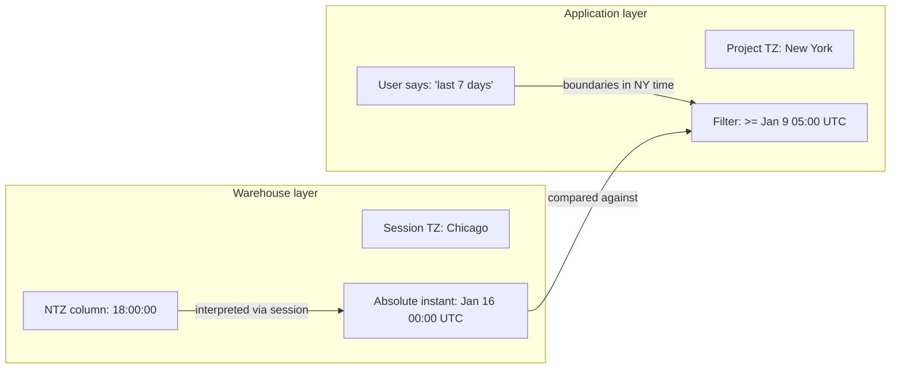
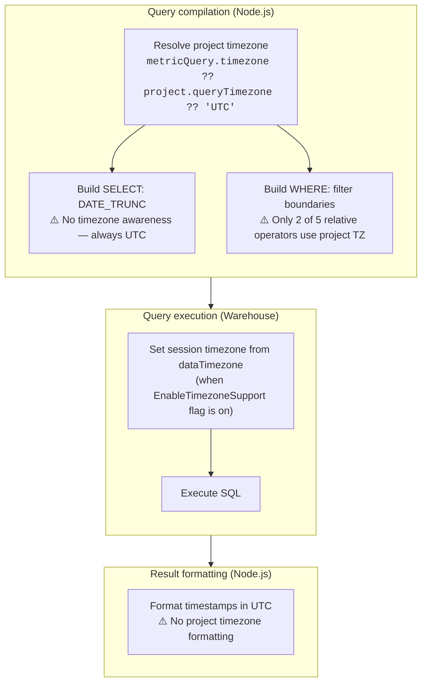
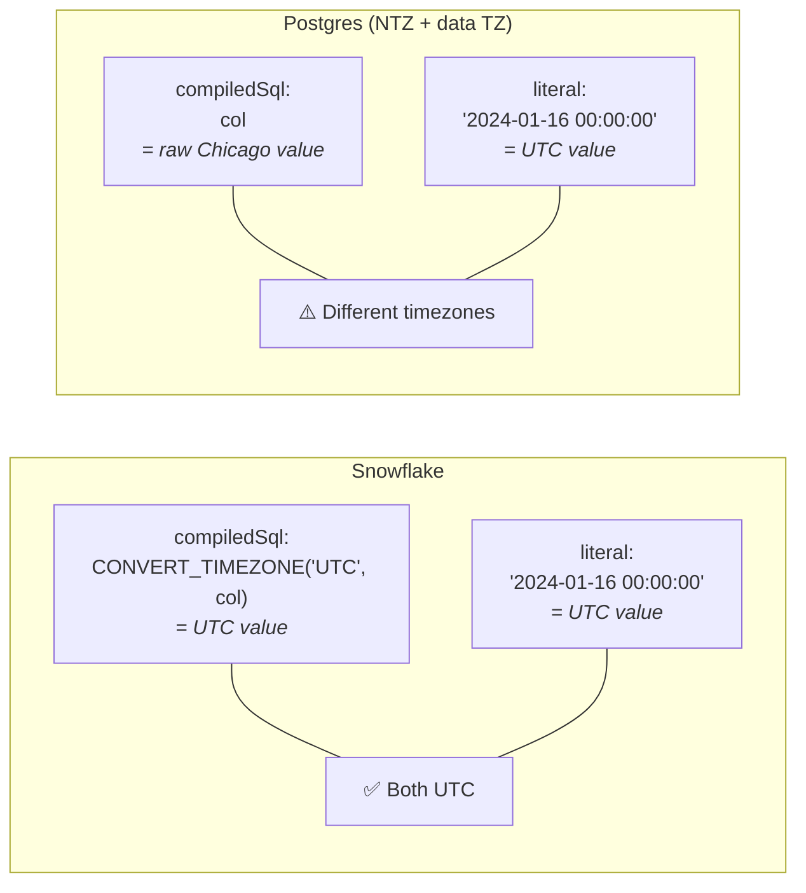

# Timezone Handling in Lightdash

This document describes how timezone handling works across the Lightdash stack: what the two timezone settings do, how they flow through SQL generation, where they're consistent, and where gaps remain.

---

## Why Two Timezone Settings?

Lightdash has two timezone settings that solve different problems at different layers:

| Setting              | Layer       | Question it answers                              | Where configured                         |
| -------------------- | ----------- | ------------------------------------------------ | ---------------------------------------- |
| **Data timezone**    | Warehouse   | "What timezone are my NTZ timestamps stored in?" | Warehouse connection → Advanced settings |
| **Project timezone** | Application | "What timezone should my users see data in?"     | Project settings → Timezone              |

The `EnableTimezoneSupport` feature flag (`LIGHTDASH_ENABLE_TIMEZONE_SUPPORT=true`) gates the data timezone feature: the warehouse form UI field and the warehouse session setup. The project timezone setting is always available.

### Data timezone (`dataTimezone`)

Answers the question: "what timezone are my NTZ (no-timezone) timestamps stored in?" Sets the warehouse session timezone (e.g., `SET timezone TO 'America/Chicago'` on Postgres) so the warehouse correctly interprets ambiguous NTZ values.

**Without it:** A stored value `2024-01-15 18:00:00` in an NTZ column is assumed to be UTC.
**With it set to `America/Chicago`:** The warehouse knows it's 6pm Chicago time (= midnight UTC next day).

For TZ columns (e.g., Postgres `timestamptz`, Snowflake `TIMESTAMP_TZ`), data timezone has no effect — these columns already store absolute instants. Gated behind `EnableTimezoneSupport` — when the flag is off, `dataTimezone` resolves to `undefined` and the warehouse session timezone is not explicitly set (preserving previous behavior).

### Project timezone (`queryTimezone`)

Controls where date boundaries fall for filters and grouping. When a user says "last 7 days," the project timezone determines what "today" means.

**Without it:** "Today" = midnight UTC.
**With it set to `America/New_York`:** "Today" = midnight Eastern time (= 4am or 5am UTC depending on DST).

### How they combine



Data timezone determines **what the data means**. Project timezone determines **what the user means**. Both convert to UTC for comparison.

---

## Current State

### SQL Pipeline

A query touches timezone in three places: the SELECT (grouping), the WHERE (filtering), and the warehouse session.



### SELECT — DATE_TRUNC grouping

DATE_TRUNC is **not timezone-aware**. All warehouses generate raw truncation with no timezone parameter:

```sql
-- Snowflake
DATE_TRUNC('DAY', col)
-- Postgres
DATE_TRUNC('day', col)
-- BigQuery
DATE_TRUNC(col, DAY)
```

Grouping boundaries are always in UTC. A row at March 1 02:00 UTC (= Feb 28 9pm New York) groups into March by UTC truncation, even if the project timezone is New York.

**File:** `packages/common/src/utils/timeFrames.ts`

### WHERE — Filter boundaries

Filter boundaries are computed in Node.js. Only 2 of 5 relative date filter operators use the project timezone:

| Operator             | Uses project timezone?                 |
| -------------------- | -------------------------------------- |
| `IN_THE_CURRENT`     | ✅ `.tz(timezone).startOf().utc()`     |
| `NOT_IN_THE_CURRENT` | ✅                                     |
| `IN_THE_PAST`        | ❌ Uses process TZ (UTC in production) |
| `NOT_IN_THE_PAST`    | ❌                                     |
| `IN_THE_NEXT`        | ❌                                     |

Filter literals are formatted without timezone offset:

```typescript
const formatTimestampAsUTCWithNoTimezone = (date: Date): string =>
  moment(date).utc().format('YYYY-MM-DD HH:mm:ss');
```

**File:** `packages/common/src/compiler/filtersCompiler.ts`

### Session — Warehouse timezone

Each warehouse client sets the session timezone from `dataTimezone` before executing the query, when the `EnableTimezoneSupport` flag is on.

**File:** `packages/warehouses/src/warehouseClients/` — per-client

| Warehouse    | Session command                     | Behavior when not set                   |
| ------------ | ----------------------------------- | --------------------------------------- |
| Snowflake    | `ALTER SESSION SET TIMEZONE = 'tz'` | Defaults to `'UTC'` (always set)        |
| Postgres     | `SET timezone TO 'tz'`              | Not set (server default, typically UTC) |
| Databricks   | `SET TIME ZONE 'tz'`                | Not set                                 |
| Trino/Athena | `SET TIME ZONE 'tz'`                | Not set                                 |
| DuckDB       | `SET TimeZone = 'tz'`               | Not set                                 |
| ClickHouse   | `clickhouse_settings.timezone`      | Not set                                 |
| BigQuery     | N/A                                 | No session timezone support             |
| Redshift     | Inherits Postgres behavior          | Not set                                 |

### Result formatting

`formatTimestamp` has no arbitrary timezone parameter — only a `convertToUTC` boolean. Results are always formatted in the process timezone (UTC in production). The API response includes no timezone metadata.

**File:** `packages/common/src/utils/formatting.ts`

---

## Snowflake `convertTimezone` Asymmetry

This is the most important implementation detail for understanding timezone behavior differences across warehouses.

**File:** `packages/common/src/compiler/translator.ts` — `convertTimezone()`

When explores are compiled, every TIMESTAMP dimension gets wrapped by `convertTimezone()`:

```typescript
if (type === DimensionType.TIMESTAMP && !disableTimestampConversion) {
  sql = convertTimezone(sql, 'UTC', 'UTC', targetWarehouse);
}
```

**Only Snowflake actually wraps the SQL.** All other warehouses return it unchanged:

| Warehouse  | `compiledSql` for a timestamp dimension                    |
| ---------- | ---------------------------------------------------------- |
| Snowflake  | `TO_TIMESTAMP_NTZ(CONVERT_TIMEZONE('UTC', "table"."col"))` |
| All others | `"table"."col"`                                            |

The Snowflake wrapper converts from the session timezone to UTC, normalizing all timestamp values to UTC at the dimension level. This means:

- **Snowflake filter LHS** is UTC-normalized → comparing against UTC filter literals works correctly
- **Other warehouses filter LHS** is the raw column → comparing against UTC filter literals works for TZ columns (absolute instants) but **not for NTZ columns with non-UTC data timezone**

### Impact on filters



For Postgres timestamptz columns the bare literal is interpreted in the session timezone, which can shift the boundary incorrectly when data timezone is non-UTC. For NTZ columns, the comparison is raw — the literal is compared as-is regardless of session timezone.

### Impact on DATE_TRUNC

DATE_TRUNC is currently not timezone-aware, so the asymmetry doesn't affect grouping today. It will matter when timezone-aware DATE_TRUNC is implemented — the function will need to use `baseDimension.compiledSql` as input, which is already UTC-normalized on Snowflake but raw on other warehouses.

---

## Current Gaps

| Gap                                                          | Description                                                                                | Impact                                                                                                |
| ------------------------------------------------------------ | ------------------------------------------------------------------------------------------ | ----------------------------------------------------------------------------------------------------- |
| **3 of 5 relative filter operators ignore project timezone** | `IN_THE_PAST`, `NOT_IN_THE_PAST`, `IN_THE_NEXT` use process TZ (UTC) instead of project TZ | "Last 7 days" means "last 7 days in UTC" even when project TZ is New York                             |
| **`metricQuery.timezone` ignored in query compilation**      | Per-chart timezone override is stored but not used when resolving the query timezone       | Chart-level timezone picker has no effect on query results                                            |
| **DATE_TRUNC is not timezone-aware**                         | Grouping boundaries are always UTC                                                         | A row at March 1 02:00 UTC (= Feb 28 9pm NY) groups into March, not February                          |
| **Filter literals have no timezone offset**                  | Bare strings like `'2024-01-16 00:00:00'` are interpreted by the warehouse in session TZ   | When data TZ is non-UTC, Postgres timestamptz filter boundaries shift incorrectly                     |
| **NTZ filter comparison on non-Snowflake**                   | Filter WHERE clause compares raw NTZ column against UTC literal                            | NTZ columns with non-UTC data timezone produce incorrect filter results on Postgres, Databricks, etc. |
| **Result formatting is UTC-only**                            | `formatTimestamp` has no arbitrary timezone parameter                                      | Formatted values always show UTC regardless of project timezone                                       |
| **No timezone metadata in API response**                     | The frontend doesn't know what timezone results are in                                     | No timezone indicator in the UI                                                                       |
| **Scheduled deliveries use UTC**                             | Query formatting in email/Slack uses process timezone                                      | Scheduled reports don't match Explorer display                                                        |
| **BigQuery/Redshift: no session timezone**                   | No session timezone support for these warehouses                                           | Data timezone setting has no effect                                                                   |
| **`convertTimezone` is a stub**                              | Only Snowflake gets conversion; `source_tz` and `target_tz` params are unused              | Non-Snowflake warehouses have no compile-time timestamp normalization                                 |

---

## Vision

The goal is for both timezone settings to work consistently across all warehouses and all SQL layers:

```
┌─────────────────────────────────────────────────────────┐
│                    User's query                          │
│  "Show me orders from last 7 days, grouped by day"       │
└──────────────────────┬──────────────────────────────────┘
                       │
              ┌────────▼────────┐
              │ Project timezone │  "Last 7 days in New York"
              │ (filter + group) │  → boundaries at midnight ET
              └────────┬────────┘
                       │
              ┌────────▼────────┐
              │  Data timezone   │  "My NTZ data is in Chicago"
              │  (interpret raw) │  → session TZ = Chicago
              └────────┬────────┘
                       │
              ┌────────▼────────┐
              │   SQL execution  │  Everything compared in UTC:
              │                  │  - Filter literals: UTC
              │                  │  - Column values: normalized to UTC
              │                  │  - DATE_TRUNC: in project TZ, result as UTC
              └────────┬────────┘
                       │
              ┌────────▼────────┐
              │ Result display   │  Formatted in project timezone
              │                  │  with timezone indicator
              └─────────────────┘
```

### What "fully working" means

1. **Filters:** All relative operators compute boundaries in project TZ. Literals are unambiguously UTC. Comparison works for both TZ and NTZ columns on all warehouses.
2. **DATE_TRUNC:** Groups at project TZ boundaries on all warehouses.
3. **Display:** Formatted timestamps reflect the project timezone, with timezone indicator in the UI.
4. **Scheduled deliveries:** Results match what the user sees in the Explorer.
5. **NTZ normalization:** Filter WHERE clause normalizes NTZ columns to UTC (like DATE_TRUNC will) so UTC literals compare correctly.

### Open design questions

- **Should `convertTimezone` in translator.ts normalize all warehouses to UTC?** This would fix the NTZ filter issue at the source but has a large blast radius — it changes `compiledSql` for all timestamp dimensions on all warehouses.
- **Or should the filter path normalize per-query?** Apply `::timestamptz` (or equivalent) to the filter column in MetricQueryBuilder when data timezone is set. Smaller blast radius but adds per-warehouse SQL to the filter path.

---

## File Reference

| Component               | File                                                                   |
| ----------------------- | ---------------------------------------------------------------------- |
| `convertTimezone`       | `packages/common/src/compiler/translator.ts`                           |
| Filter compilation      | `packages/common/src/compiler/filtersCompiler.ts`                      |
| DATE_TRUNC              | `packages/common/src/utils/timeFrames.ts`                              |
| Timezone resolution     | `packages/common/src/utils/resolveQueryTimezone.ts`                    |
| MetricQueryBuilder      | `packages/backend/src/utils/QueryBuilder/MetricQueryBuilder.ts`        |
| AsyncQueryService       | `packages/backend/src/services/AsyncQueryService/AsyncQueryService.ts` |
| Project timezone config | `packages/backend/src/services/ProjectService/ProjectService.ts`       |
| Feature flags           | `packages/common/src/types/featureFlags.ts`                            |
| Warehouse credentials   | `packages/common/src/types/projects.ts`                                |
| Result formatting       | `packages/common/src/utils/formatting.ts`                              |
| Warehouse clients       | `packages/warehouses/src/warehouseClients/`                            |
