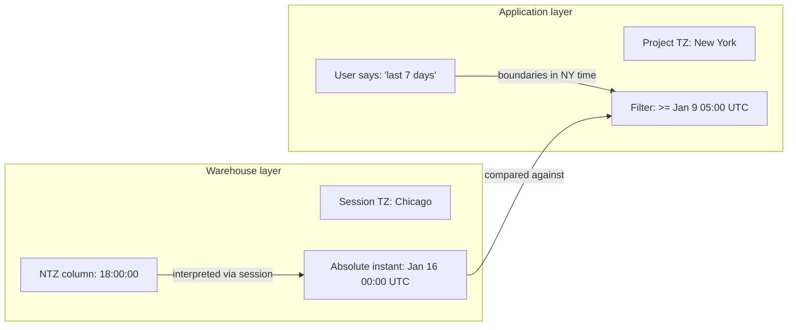
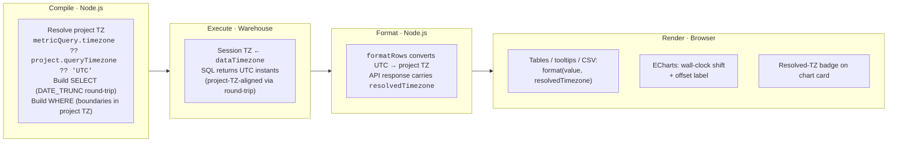
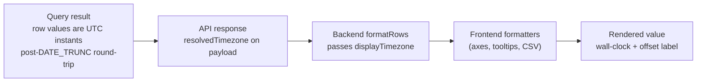
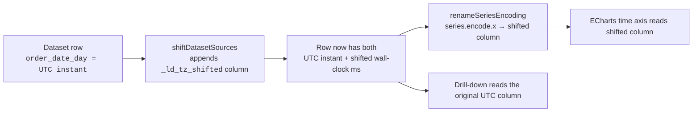
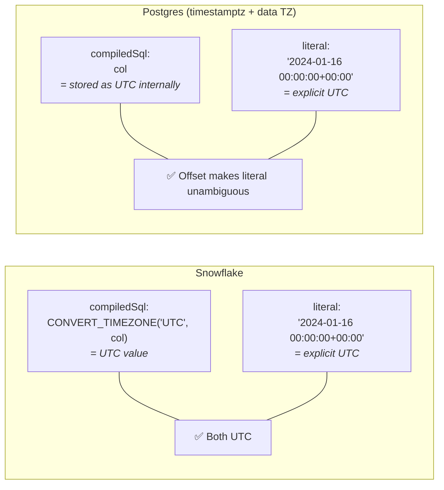
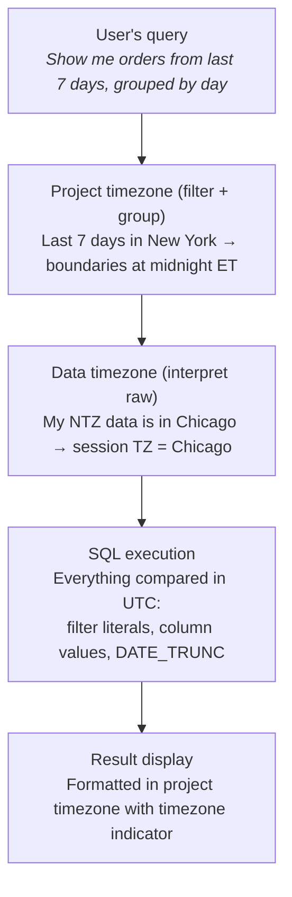

# Timezone Handling in Lightdash

How the two timezone settings work, how they flow through SQL and display, and where the rough edges are.

---

## Two timezone settings, two problems

Lightdash has two timezone settings. They look similar but solve different problems at different layers:

| Setting              | Layer       | Question it answers                              | Where configured                         |
| -------------------- | ----------- | ------------------------------------------------ | ---------------------------------------- |
| **Data timezone**    | Warehouse   | "What timezone are my NTZ timestamps stored in?" | Warehouse connection → Advanced settings |
| **Project timezone** | Application | "What timezone should my users see data in?"     | Project settings → Timezone              |

The `EnableTimezoneSupport` feature flag (`LIGHTDASH_ENABLE_TIMEZONE_SUPPORT=true`) gates the data timezone feature — both the warehouse UI field and the session setup. The project timezone setting is always available. The flag can also be toggled per-organization (or per-user) via `feature_flag_overrides` in the database, which takes precedence over the env var, so we can roll out gradually without flipping the global switch.

### Data timezone (`dataTimezone`)

Answers: "what timezone are my NTZ (no-timezone) timestamps actually stored in?" Setting it runs the right session command on the warehouse (e.g. `SET timezone TO 'America/Chicago'` on Postgres) so ambiguous NTZ values get interpreted correctly.

- **Without it:** a stored `2024-01-15 18:00:00` in an NTZ column is assumed to be UTC.
- **With `America/Chicago`:** the warehouse reads it as 6pm Chicago — midnight UTC the next day.

For TZ columns (Postgres `timestamptz`, Snowflake `TIMESTAMP_TZ`) data timezone has no effect — those are absolute instants already.

The setting is gated behind `EnableTimezoneSupport`. Flag off → `dataTimezone` is `undefined` and the session TZ isn't touched (old behavior).

### Project timezone (`queryTimezone`)

Controls where date boundaries fall for filters and grouping. When a user picks "last 7 days," the project timezone decides what "today" means.

- **Without it:** "today" = midnight UTC.
- **With `America/New_York`:** "today" = midnight ET (4am or 5am UTC depending on DST).

### How they combine



Data timezone says **what the data means**. Project timezone says **what the user means**. Both end up as UTC for comparison.

---

## Current state

End-to-end, timezone concerns are handled at four boundaries: compile in Node, execute in the warehouse, format back in Node, render in the browser.



> **Flag OFF → pre-timezone-work behavior.** With `EnableTimezoneSupport` off: no session TZ is set (Snowflake still defaults to `'UTC'`), DATE_TRUNC runs in UTC, filter literals stay bare, `resolvedTimezone` is omitted from the API, and formatters pass values through as UTC — identical to `main` before this work started.

### SELECT — DATE_TRUNC grouping

With `useTimezoneAwareDateTrunc` on, truncation is timezone-aware. The base dimension SQL is round-tripped through the project timezone so boundaries fall on project-local wall-clock midnights, but the returned value is still a real UTC instant:

1. Shift the UTC value into project wall-clock
2. Truncate on that wall-clock
3. Convert the truncated wall-clock back to UTC

The SQL differs per warehouse (some have native TZ-aware truncation, others compose `AT TIME ZONE` / `CONVERT_TIMEZONE` / `to_utc_timestamp`), but the shape is identical everywhere. Flag off → falls back to raw `DATE_TRUNC` grouping in UTC (old behavior).

**Filter parity.** When the round-trip is active, the WHERE clause reuses the same wrapped expression for the LHS so filter literals (still UTC with a `+00:00` offset on most warehouses) compare against the same shifted value the SELECT groups on.

**Truncated intervals on a DATE base dimension skip the round-trip.** A truncated interval whose base column is a DATE (e.g. `order_date_month`) falls back to raw `DATE_TRUNC`. DATE values carry no time component — casting one into `timestamptz` for the round-trip would anchor at midnight and then cross a day boundary whenever the project timezone has a non-zero offset.

**Files:** `packages/common/src/utils/timeFrames.ts`, `packages/backend/src/utils/QueryBuilder/MetricQueryBuilder.ts`

### WHERE — Filter boundaries

Filter boundaries are computed in Node.js. All relative date filter operators use the project timezone via `.tz(timezone)`:

| Operator             | Uses project timezone?             |
| -------------------- | ---------------------------------- |
| `IN_THE_CURRENT`     | ✅ `.tz(timezone).startOf().utc()` |
| `NOT_IN_THE_CURRENT` | ✅                                 |
| `IN_THE_PAST`        | ✅                                 |
| `NOT_IN_THE_PAST`    | ✅                                 |
| `IN_THE_NEXT`        | ✅                                 |

Timestamp filter literals include the UTC offset so the warehouse reads them unambiguously:

```typescript
const formatTimestampAsUTC = (date: Date): string =>
  moment(date).utc().format('YYYY-MM-DD HH:mm:ssZ');
// e.g. '2024-01-16 00:00:00+00:00'
```

BigQuery and ClickHouse get a bare literal instead — BigQuery's `DATETIME` rejects offsets and ClickHouse's `date_time_input_format` may be set to `'basic'`, which can't parse them:

```typescript
const formatTimestampAsUTCNoOffset = (date: Date): string =>
  moment(date).utc().format('YYYY-MM-DD HH:mm:ss');
// e.g. '2024-01-16 00:00:00'
```

**Filters on a truncated interval with a DATE base dimension skip the timestamptz wrap.** A filter on e.g. `order_date_month` emits bare date literals — no `+00:00`, no `::timestamptz` cast. Same reason as the SELECT-side bypass: the LHS is a raw calendar value, so wrapping the literal as a timestamptz would re-introduce the midnight-anchor drift we're trying to avoid.

**DATE-dimension boundaries are server-timezone-independent.** DATE-dimension filter boundaries are computed and formatted in UTC (flag off) or the project timezone (flag on) — never in the server's local timezone. Previously the default formatter used `moment(date)`, which read the process timezone — on a server with a positive UTC offset, `endOf('day')` would shift into the next calendar day and produce a 2-day filter range.

**File:** `packages/common/src/compiler/filtersCompiler.ts`

### Session — Warehouse timezone

Each warehouse client sets the session timezone from `dataTimezone` before running the query, when `EnableTimezoneSupport` is on.

| Warehouse  | Session command                               | Behavior when not set                   |
| ---------- | --------------------------------------------- | --------------------------------------- |
| Snowflake  | `ALTER SESSION SET TIMEZONE = 'tz'`           | Defaults to `'UTC'` (always set)        |
| Postgres   | `SET timezone TO 'tz'`                        | Not set (server default, typically UTC) |
| Redshift   | `SET timezone TO 'tz'` (inherits Postgres)    | Not set                                 |
| Databricks | `SET TIME ZONE 'tz'`                          | Not set                                 |
| Trino      | `SET TIME ZONE 'tz'`                          | Not set                                 |
| DuckDB     | `SET TimeZone = 'tz'`                         | Not set                                 |
| ClickHouse | `clickhouse_settings.session_timezone`        | Not set                                 |
| BigQuery   | N/A (accepts parameter but never applies it)  | No session timezone support             |
| Athena     | N/A (accepts parameter but never applies it)  | No session timezone support             |

The data timezone UI field is hidden for BigQuery and Athena since there's no session TZ plumbing to plug it into.

**File:** `packages/warehouses/src/warehouseClients/` — per-client

### Result formatting

The DATE_TRUNC round-trip produces real UTC instants whose wall-clock alignment matches project midnights. Display formatters convert those instants back into the project zone at render time.

`formatTimestamp` takes two timezone parameters for different call-sites:

| Parameter         | When to use                                                                 | What it does                                                |
| ----------------- | --------------------------------------------------------------------------- | ----------------------------------------------------------- |
| `timezone`        | Value is a UTC instant (common case — backend + CSV exports)                | Converts the UTC value into the given zone, then formats it |
| `displayTimezone` | Value has already been pre-shifted to wall-clock ms (ECharts path only)     | Only appends the zone's offset suffix — no conversion       |

`formatDate` takes a single `timezone` parameter and is bypassed entirely for truncated intervals on a DATE base dimension (see callout below).

The resolved timezone rides on the API response (`resolvedTimezone` on `ApiExecuteAsyncQueryResultsCommon`) and is threaded into every downstream formatter:

- Backend row transformation (`formatRows`) converts each row's UTC value into the resolved zone before serializing
- Frontend cartesian chart axes (`getCartesianAxisFormatterConfig`) use `displayTimezone` after the ECharts wall-clock shift so tick labels line up with rendered positions
- Chart tooltips (`tooltipFormatter`) use the same pair via `resolveAxisTimezone` so headers and hover values agree with the axis
- CSV exports — including pivot CSVs — run through the backend formatter, so downloads match the Explorer view
- The chart card shows a resolved-timezone badge so users can see which zone they're looking at



> **Callout — truncated intervals on a DATE base dimension skip the timezone shift.**
> A truncated interval whose base column is a DATE (e.g. `order_date_month`) is a pure calendar value with no time component. The DATE_TRUNC round-trip doesn't apply, and neither does display formatting: `formatItemValue` drops the `timezone` argument in the DATE branch when `timeIntervalBaseDimensionType === DATE`. Applying a TZ shift would anchor "March 1" at UTC midnight and then move it to Feb 28 in any negative-offset zone. These dimensions always render as the raw calendar date they represent.

**Files:** `packages/common/src/utils/formatting.ts`, `packages/common/src/visualizations/helpers/getCartesianAxisFormatterConfig.ts`, `packages/common/src/visualizations/helpers/tooltipFormatter.ts`, `packages/common/src/types/api.ts`

### Frontend ECharts: x-axis wall-clock shift

ECharts renders cartesian charts with `useUTC: true` — every numeric time value on a time axis sits on a UTC scale, and there's no supported way to tell it "draw this axis in project time." Feeding it a UTC instant with a non-UTC project TZ would snap tick marks to UTC midnights, contradicting the DATE_TRUNC round-trip the backend just did.

**The workaround: a shifted-wall-clock companion column.** The shift helper adds a *new* column next to the original. For `order_date_day`, a sibling `order_date_day_ld_tz_shifted` gets appended to every row. The sibling holds the instant plus the project's offset for that instant — not a real UTC millisecond, but a value that ECharts (still in `useUTC: true`) renders exactly on project-local wall-clock positions. The original UTC column stays put, so drill-down, tooltip payloads, and anything else reading the row directly still see real instants.



The suffix is one constant — `SHIFTED_DIM_SUFFIX = '_ld_tz_shifted'` — used in two places:

1. `shiftDatasetSources` appends the companion to `dataset.source`
2. `renameSeriesEncoding` rewrites `encode.x` (or `encode.y` when axes are flipped) to point at the sibling

Inline array-style series data (`[x, y]` tuples) has no dataset dimension to rename, so those arrays are shifted in place at the axis slot.

**The formatter pair flips with the shift.** The axis value no longer represents a real UTC instant, so the formatter pair has to flip. `resolveAxisTimezone()` centralizes this, so axis tick formatters, tooltip headers, and value formatters all see the same pair:

| State                      | `timezone`         | `displayTimezone`  | Reason                                                                  |
| -------------------------- | ------------------ | ------------------ | ----------------------------------------------------------------------- |
| Time axis is shifted       | `undefined`        | `resolvedTimezone` | Values are already wall-clock — don't re-convert, only label the offset |
| No shift (category / UTC)  | `resolvedTimezone` | `undefined`        | Values are still UTC instants — formatter converts and labels normally  |

**Skipped for:** category-axis intervals (`WEEK`, `MONTH`, `QUARTER`, `YEAR`) — rendered as strings, not numeric positions; UTC or unresolved timezone — shift would be a no-op; pivot metadata (legend labels, stack totals) — those go through the formatter path, not the ECharts time scale.

**Files:** `packages/frontend/src/hooks/echarts/timezoneShift.ts`, `packages/frontend/src/hooks/echarts/useEchartsCartesianConfig.ts`, `packages/common/src/visualizations/helpers/tooltipFormatter.ts`

> **This is a workaround, not a feature.** It deliberately breaks the invariant that an axis value is a real UTC instant. Anything that reads the *shifted* column directly (instead of going through the formatter pair or the companion UTC column) will see wall-clock milliseconds, not UTC. New ECharts integrations on time axes must either consume the original field (not the `_ld_tz_shifted` sibling) or route through `resolveAxisTimezone`. If [apache/echarts#21475](https://github.com/apache/echarts/pull/21475) lands and we adopt it, the shift, the companion column, and the formatter swap can all go away.

---

## Snowflake `convertTimezone` asymmetry

The single most important detail for understanding why timezone behavior differs across warehouses.

**File:** `packages/common/src/compiler/translator.ts` — `convertTimezone()`

When explores compile, every TIMESTAMP dimension gets wrapped by `convertTimezone()`:

```typescript
if (type === DimensionType.TIMESTAMP && !disableTimestampConversion) {
  sql = convertTimezone(sql, 'UTC', 'UTC', targetWarehouse);
}
```

**Only Snowflake actually wraps the SQL.** Every other warehouse returns the input unchanged:

| Warehouse  | `compiledSql` for a timestamp dimension                    |
| ---------- | ---------------------------------------------------------- |
| Snowflake  | `TO_TIMESTAMP_NTZ(CONVERT_TIMEZONE('UTC', "table"."col"))` |
| All others | `"table"."col"`                                            |

The Snowflake wrapper converts from the session timezone to UTC, normalizing every timestamp to UTC at the dimension level. That means:

- **Snowflake filter LHS** is UTC-normalized by the wrapper → comparing against UTC filter literals works regardless of the warehouse's own type coercion
- **Other warehouses' filter LHS** is the raw column → comparison relies on the warehouse's implicit coercion between NTZ columns and TZ-aware literals, which in turn depends on the session timezone being set. This works everywhere with session TZ plumbing and fails on BigQuery/Athena

### Impact on filters

Filter literals include the UTC offset (`+00:00`) on most warehouses, which makes TZ-column comparison unambiguous:



For Postgres **timestamptz** columns, the `+00:00` offset ensures the literal is read as UTC regardless of session timezone. For **NTZ** columns, correctness relies on the warehouse promoting the column to a TZ-aware value using the session timezone (Postgres does this when comparing `timestamp` against a `timestamptz` literal; Databricks and DuckDB behave similarly). BigQuery and ClickHouse use bare literals because of parser limits, so their NTZ comparisons don't get that promotion.

### Impact on DATE_TRUNC

The timezone-aware DATE_TRUNC round-trip uses `baseDimension.compiledSql` as input. On Snowflake the input is already UTC-normalized by the wrapper, so the round-trip sees clean UTC instants. On other warehouses the input is the raw column and correctness comes from two different mechanisms:

- **Session-TZ-aware warehouses** (Postgres, Redshift, Databricks, DuckDB, Trino) rely on the warehouse reading naive values through the session timezone — `::timestamptz` casts on Postgres, `current_timezone()` on Databricks, etc.
- **BigQuery** uses the native `TIMESTAMP_TRUNC(col, part, 'tz')` directly; the `toProjectTz`/`toUTC` helpers are deliberate no-ops because the truncation itself accepts the zone. TIMESTAMP columns (UTC instants) round-trip correctly this way.

The only remaining hole is NTZ-style columns storing non-UTC data on warehouses with no session-TZ plumbing — BigQuery `DATETIME` and Athena naive `TIMESTAMP`. The warehouse has no way of knowing what zone those values are in, so they can't be rebased to UTC.

---

## Current gaps

| Gap                                                              | Description                                                                                                                                                                                                                                                                           | Impact                                                                                                                                            |
| ---------------------------------------------------------------- | ------------------------------------------------------------------------------------------------------------------------------------------------------------------------------------------------------------------------------------------------------------------------------------- | ------------------------------------------------------------------------------------------------------------------------------------------------- |
| **EXTRACT-based time dimensions are not timezone-aware**         | Intervals that use EXTRACT/DATE_PART rather than DATE_TRUNC (e.g. `DAY_OF_WEEK_INDEX`, `MONTH_NUM`, `HOUR_OF_DAY_NUM`, `QUARTER_NUM`) read parts of the raw UTC value                                                                                                                 | "Day of week" and similar slicers bucket rows by UTC components, which can disagree with a project-TZ DATE_TRUNC grouped next to them             |
| **BigQuery/Athena: no session timezone**                         | These warehouses have no session-timezone plumbing, so the data-timezone setting is inert. NTZ-style columns (BigQuery `DATETIME`, Athena bare `TIMESTAMP`) can't be rebased from their stored zone to UTC                                                                           | Data timezone setting has no effect (UI field is hidden); NTZ columns holding non-UTC data can't be normalized                                    |
| **Excel exports render DATE/TIMESTAMP cells in UTC**             | `convertRowToExcel` writes raw `Date` objects for field-level DATE and TIMESTAMP values so Excel treats the cell as a native date (sortable, filterable, with column-level `numFmt`). Routing through the timezone-aware formatter returns a string and loses those semantics. `Date` also carries no zone — ExcelJS serializes via UTC components — so there's no clean way to land a project-TZ wall-clock in a real date cell | Excel downloads show UTC wall-clock for DATE/TIMESTAMP columns, so Excel and CSV downloads of the same query disagree when a project timezone is set |
| **Google Sheets pivot deliveries render TIMESTAMP/DATE cells in UTC** | Gsheet pivot deliveries call `pivotResultsAsCsv({ onlyRaw: true })`, which reads `value.raw` and skips the timezone-formatted output from `formatRows`. Pivot column headers built via `formatItemValue` also omit the timezone args. Kept raw so columns preserve their native types in Google Sheets | Gsheet pivot output renders timestamps in UTC even with `EnableTimezoneSupport` on, so it disagrees with the Explorer view when the project TZ is non-UTC |

---

## Vision

Both timezone settings, working consistently across every warehouse and every SQL layer.



### What "fully working" means

1. **Filters:** all relative operators compute boundaries in project TZ, literals are unambiguously UTC (with the known BigQuery/ClickHouse bare-literal caveat), and comparisons work for both TZ and NTZ columns on every warehouse with session-TZ plumbing.
2. **DATE_TRUNC:** groups at project-TZ boundaries on every warehouse. Truncated intervals round-trip through project wall-clock. EXTRACT-based intervals still read UTC components — the remaining correctness gap.
3. **Display:** formatted timestamps reflect the project timezone across Explorer, chart axes, tooltips, and CSV exports, with the resolved zone labelled in the UI. Truncated intervals on a DATE base dimension skip the shift so calendar dates render as-is.
4. **NTZ normalization:** NTZ columns are interpreted via the data timezone at query time. Today this relies on warehouse session-TZ plumbing — every supported warehouse has it except BigQuery and Athena, where NTZ-style columns with non-UTC data are stuck.

---

## File reference

| Component               | File                                                                   |
| ----------------------- | ---------------------------------------------------------------------- |
| `convertTimezone`       | `packages/common/src/compiler/translator.ts`                           |
| Filter compilation      | `packages/common/src/compiler/filtersCompiler.ts`                      |
| DATE_TRUNC              | `packages/common/src/utils/timeFrames.ts`                              |
| Timezone resolution     | `packages/common/src/utils/resolveQueryTimezone.ts`                    |
| MetricQueryBuilder      | `packages/backend/src/utils/QueryBuilder/MetricQueryBuilder.ts`        |
| AsyncQueryService       | `packages/backend/src/services/AsyncQueryService/AsyncQueryService.ts` |
| Project timezone config | `packages/backend/src/services/ProjectService/ProjectService.ts`       |
| Feature flags           | `packages/common/src/types/featureFlags.ts`                            |
| Warehouse credentials   | `packages/common/src/types/projects.ts`                                |
| Result formatting       | `packages/common/src/utils/formatting.ts`                              |
| Warehouse clients       | `packages/warehouses/src/warehouseClients/`                            |
