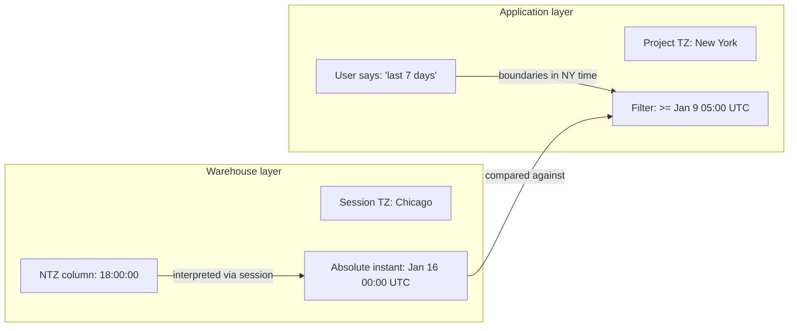
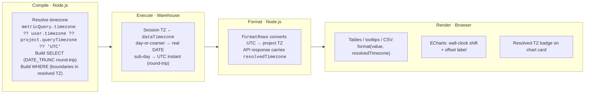
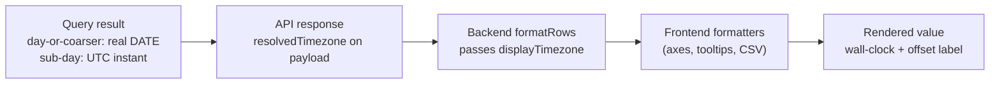
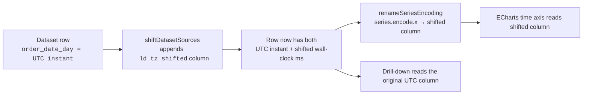
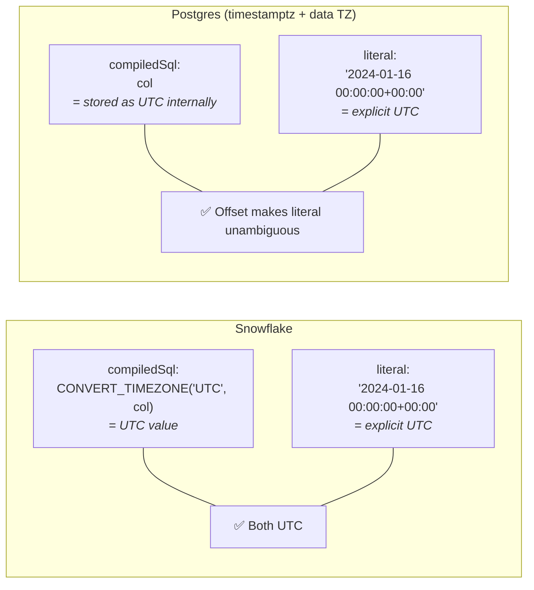
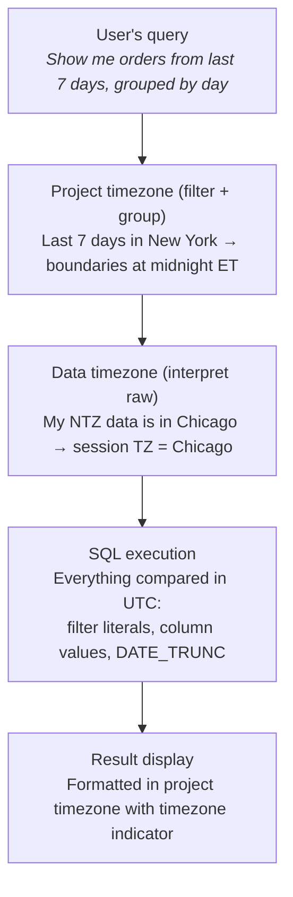

# Timezone Handling in Lightdash

How the two timezone settings work, how they flow through SQL and display, and where the rough edges are.

---

## Two timezone settings, two problems

Lightdash has two timezone settings. They look similar but solve different problems at different layers:

| Setting              | Layer       | Question it answers                              | Where configured                         |
| -------------------- | ----------- | ------------------------------------------------ | ---------------------------------------- |
| **Data timezone**    | Warehouse   | "What timezone are my NTZ timestamps stored in?" | Warehouse connection → Advanced settings |
| **Project timezone** | Application | "What timezone should my users see data in?"     | Project settings → Timezone              |

In addition, three overrides sit on top of the project timezone (the session timezone applies only to embedded sessions):

| Override               | Scope              | Wins over project? | Where configured                  |
| ---------------------- | ------------------ | ------------------ | --------------------------------- |
| **Session timezone**   | Per embed session  | ✅ (wins over chart, user, project) | Embed page URL `?timezone=<IANA>` |
| **User timezone**      | Per viewer         | ✅                 | Profile settings → Default timezone |
| **Chart timezone**     | Per saved chart    | ✅ (also wins over user) | Explorer header → Timezone picker |

Resolution order: `session (embed URL) → chart → user → project → server default ('UTC')`. A viewer with no profile preference falls through to the project. A viewer with a profile timezone sees their zone on charts that don't pin one. An embedding host can pin a single session to a zone via the `?timezone=` URL param, which outranks even the chart pin. See [User-level timezone](#user-level-timezone) below.

A single flag gates timezone behavior:

| Flag                    | Env var                               | Gates                                                                                                                                                  |
| ----------------------- | ------------------------------------- | ------------------------------------------------------------------------------------------------------------------------------------------------------ |
| `EnableTimezoneSupport` | `LIGHTDASH_ENABLE_TIMEZONE_SUPPORT`   | The whole timezone feature: data-timezone warehouse field + session-TZ setup, the "filter inputs in project TZ" toggle, the user-facing timezone pickers (Profile panel, Explorer chart-level), and per-viewer (user-profile) timezone resolution |

The project timezone setting itself is always available. `resolveQueryTimezone` always honors a chart pinned to `user_timezone` — falling back to the project timezone only when the viewer has no stored profile preference. The `EnableTimezoneSupport` flag gates the surrounding pipeline (warehouse session setup, timezone-aware `DATE_TRUNC`, returning `displayTimezone`), so when the flag is off the resolved zone simply isn't applied to the query. The flag can be toggled per-organization (or per-user) via `feature_flag_overrides` in the database, which takes precedence over the env var, so we can roll out gradually without flipping the global switch.

### Data timezone (`dataTimezone`)

Answers: "what timezone are my NTZ (no-timezone) timestamps actually stored in?" Setting it runs the right session command on the warehouse (e.g. `SET timezone TO 'America/Chicago'` on Postgres) so ambiguous NTZ values get interpreted correctly.

- **Without it:** a stored `2024-01-15 18:00:00` in an NTZ column is assumed to be UTC.
- **With `America/Chicago`:** the warehouse reads it as 6pm Chicago — midnight UTC the next day.

For TZ columns (Postgres `timestamptz`, Snowflake `TIMESTAMP_TZ`) data timezone has no effect — those are absolute instants already.

The setting is gated behind `EnableTimezoneSupport`. Flag off → `dataTimezone` is `undefined` and the session TZ isn't touched (old behavior).

### Project timezone (`queryTimezone`)

Controls where date boundaries fall for filters and grouping. When a user picks "last 7 days," the project timezone decides what "today" means.

- **Without it:** "today" = midnight UTC.
- **With `America/New_York`:** "today" = midnight ET (4am or 5am UTC depending on DST).

### User-level timezone

Per-viewer override stored on the `users` row (`users.timezone`, IANA string or `NULL`). Slots between the chart-level and project-level layers in the resolution chain:

```
metricQuery.timezone  →  user.timezone  →  project.queryTimezone  →  config  →  'UTC'
```

- A viewer with `timezone = 'Asia/Tokyo'` sees charts in Tokyo whenever the chart hasn't pinned its own timezone.
- An author can still "pin" a chart to a specific zone via the Explorer timezone picker — that fixed zone then wins for every viewer.
- Charts without a pinned zone fall through per-viewer, so each reader sees their own zone.

Resolution happens server-side in [`resolveQueryTimezone`](../../packages/common/src/utils/resolveQueryTimezone.ts). Anonymous viewers (embeds / JWT) and service accounts have no profile timezone — the helper `getAccountUserTimezone(account)` returns `null` for them. Embedded sessions can still set a per-session query timezone via the `?timezone=<IANA>` embed URL param, which is threaded in as the top-priority `sessionTimezone` argument and outranks the chart pin; absent that param they fall through to the project default.

**Worker / retrieval paths** (queued warehouse execution, pre-aggregate workers, results pagination, downloads, ready-results fetch) don't re-resolve the timezone. `executePreparedAsyncQuery` stamps the resolved chart > user > project timezone onto `metricQuery.timezone` before persisting the query history snapshot, so any method that receives a `queryUuid` reads it back directly as `queryHistory.metricQuery.timezone` — no resolver helper, no project lookup, no flag check.

**Pre-aggregate materialization is an exception.** Materializations build shared tables queried by every viewer, so the user-level layer is skipped. When `prepareMetricQueryAsyncQueryArgs` is called with a `materializationRole`, `userTimezone` is forced to `null` regardless of the triggering account — the materialization SQL compiles against `chart.timezone ?? project.queryTimezone`, never the triggering user's profile preference.

**Files:** `packages/common/src/utils/resolveQueryTimezone.ts` (chain + `getAccountUserTimezone`), `packages/backend/src/services/UserService.ts` (validation on update), `packages/frontend/src/components/UserSettings/ProfilePanel/index.tsx` (profile UI).

### How they combine



Data timezone says **what the data means**. Project timezone says **what the user means**. Both end up as UTC for comparison.

---

## Current state

End-to-end, timezone concerns are handled at four boundaries: compile in Node, execute in the warehouse, format back in Node, render in the browser.



> **Flag OFF → pre-timezone-work behavior.** With `EnableTimezoneSupport` off: no session TZ is set (Snowflake still defaults to `'UTC'`), DATE_TRUNC runs in UTC, filter literals stay bare, `resolvedTimezone` is omitted from the API, and formatters pass values through as UTC — identical to `main` before this work started.

### SELECT — DATE_TRUNC grouping

With `useTimezoneAwareDateTrunc` on, truncation is timezone-aware. The base dimension SQL is round-tripped through the project timezone so boundaries fall on project-local wall-clock midnights:

1. Shift the column value from its source TZ into project wall-clock
2. Truncate on that wall-clock
3. **Day-or-coarser grains** (day / week / month / quarter / year) `CAST(... AS DATE)` the truncated wall-clock — the result is a real `DATE` calendar value (GLITCH-452). **Sub-day grains** (hour / minute / second / millisecond) convert the truncated wall-clock back to UTC and return a real UTC instant.

> The cast is applied to the **truncated wall-clock value**, not to its UTC round-trip — casting the UTC instant would yield the wrong calendar date in non-UTC zones. So for day-or-coarser grains the final `toUTC` step is dropped, not wrapped.
>
> **Per-adapter cast.** Most warehouses truncate to a naive wall-clock value, so `CAST(... AS DATE)` reads the right calendar date. **BigQuery** instead uses `DATE(<expr>, '<tz>')` — its `TIMESTAMP_TRUNC` returns the tz-midnight value as a *UTC instant*, so `CAST(... AS DATE)` would read its UTC date and land a day early in positive offsets (e.g. `Asia/Tokyo` bucketed a `15:00Z` row to the previous day until this was fixed; verified against BigQuery).

The source TZ for step 1 is derived once per query at the service boundary via `getColumnTimezone(credentials)` (in `packages/common/src/types/projects.ts`) and threaded through `timeFrames.ts` as `sourceTimezone`. It returns `'UTC'` for Snowflake when the translator wrap is active, `dataTimezone` when Snowflake's `disableTimestampConversion` opts out of that wrap, and `dataTimezone` (defaulting to UTC) for every other adapter. Most warehouses ignore it because their `toProjectTz` doesn't take a source TZ; Snowflake threads it into the inner `CONVERT_TIMEZONE`.

The SQL differs per warehouse (some have native TZ-aware truncation, others compose `AT TIME ZONE` / `CONVERT_TIMEZONE` / `to_utc_timestamp`), but the shape is identical everywhere. Flag off → falls back to raw `DATE_TRUNC` grouping in UTC (old behavior).

> **Per-warehouse divergence at a DST fall-back.** The naive-domain routes (Postgres, Snowflake, Databricks, Trino, Redshift, DuckDB, Spark) and the instant-domain routes (BigQuery, ClickHouse) bucket the two folded 1 AM hours differently: merge into one `count=2` bucket vs split into two. This is a property of our conversion map, not of the warehouses, and no deliberate call has been made. See [`timezone-questions.md`](./timezone-questions.md) → "DST fall-back" and `gap-dst-fold-bucketing`.

**No-op short-circuit when target equals source.** When the resolved query timezone matches the column source TZ (e.g. a UTC project on a UTC-stored column), the wrap is semantically a no-op — and on BigQuery it defeats partition pruning, leading to unbounded scans. `resolveTimezoneWrap` (via the shared `isTimezoneRoundTripNoOp` predicate) skips the wrap entirely at the boundary, so every call site — DATE_TRUNC, EXTRACT, format wrap, filter literal — short-circuits to the unwrapped form symmetrically. The predicate lives in `timeFrames.ts` so new call sites that forget to check it inherit the same behavior.

**Filter parity.** When the round-trip is active, the WHERE clause reuses the same wrapped expression for the LHS so filter literals compare against the same value the SELECT groups on — bare dates for day-or-coarser grains (matching the `DATE` LHS, see below), or UTC with a `+00:00` offset on most warehouses for sub-day grains.

**Truncated intervals on a DATE base dimension skip the round-trip.** A truncated interval whose base column is a DATE (e.g. `order_date_month`) falls back to raw `DATE_TRUNC`. DATE values carry no time component — casting one into `timestamptz` for the round-trip would anchor at midnight and then cross a day boundary whenever the project timezone has a non-zero offset.

**Day-or-coarser grains converge on `DATE` regardless of base type (GLITCH-452).** A DATE-base interval emits raw `DATE_TRUNC` (already a DATE); a TIMESTAMP-base interval round-trips through project wall-clock and then `CAST(... AS DATE)`. Both return a real calendar `DATE`, so the warehouse type matches the dimension metadata (`DATE`) and no display-time correction is needed. The WHERE clause for these dimensions emits **bare date literals** (no `+00:00` offset, no `::timestamptz`) to compare cleanly against the `DATE` LHS — the same literal path DATE-base dimensions already used. Only sub-day TIMESTAMP-base grains still return a UTC instant. Gated by `castDayGrainToDate` threaded from `MetricQueryBuilder.getTimezoneAwareDimensionSql`, so it is inert when the flag is off.

### SELECT — EXTRACT-based grouping

EXTRACT/DATE_PART intervals (`DAY_OF_WEEK_INDEX`, `DAY_OF_MONTH_NUM`, `DAY_OF_YEAR_NUM`, `WEEK_NUM`, `MONTH_NUM`, `QUARTER_NUM`, `YEAR_NUM`, `HOUR_OF_DAY_NUM`, `MINUTE_OF_HOUR_NUM`) and the format/name variants (`DAY_OF_WEEK_NAME`, `MONTH_NAME`, `QUARTER_NAME`) compile to UTC-only SQL and are rewritten at query time to extract calendar components in the project timezone. Unlike DATE_TRUNC there is no round-trip — EXTRACT returns a number/string, not a timestamp — so the input is shifted from its source TZ into the project zone once before extracting. The source TZ comes from the same `getColumnTimezone(credentials)` helper described above. The shift expression is the same per-warehouse pattern used by DATE_TRUNC's `toProjectTz`, except for BigQuery, whose native form is `<expr> AT TIME ZONE 'tz'` concatenated inside `EXTRACT(... FROM ...)`. Defined in `dateExtractsTimezoneConversions`.

A "Day of week" or "Month number" dimension grouped next to a DATE_TRUNC sibling now buckets rows on the same project-TZ calendar — the previous gap where the two could disagree (e.g. one row showing under "Tue" and the other under "Mon" for the same instant) is closed.

**Filter parity** is the same as DATE_TRUNC: WHERE LHS reuses the wrapped expression so a filter like `day_of_week_index = 1` compares against the same project-TZ DOW the SELECT groups on.

**EXTRACT-based intervals on a DATE base dimension skip the wrap.** Same reason as the DATE_TRUNC bypass: a DATE column has no time component, so EXTRACT is already in the project's calendar by definition.

**Files:** `packages/common/src/utils/timeFrames.ts`, `packages/backend/src/utils/QueryBuilder/MetricQueryBuilder.ts`

### Per-dimension display opt-out (`convert_timezone: false`)

By default every TIMESTAMP dimension follows the project timezone for display. Some columns (system timestamps, audit logs, pre-converted values) need to render in their raw warehouse value instead. Set `convert_timezone: false` on the dimension's YAML meta to opt that single column out:

```yaml
- name: created_at_utc
  meta:
    dimension:
      type: timestamp
      convert_timezone: false
```

The flag is asymmetric: it affects **display** only.

| Layer                                              | Honors `convert_timezone: false`? | Reason                                                              |
| -------------------------------------------------- | --------------------------------- | ------------------------------------------------------------------- |
| SELECT — DATE_TRUNC                                | ✅                                | Whole TZ-aware path skipped — raw `DATE_TRUNC` emitted, no DATE cast |
| SELECT — EXTRACT-based                             | ✅                                | Wrap is skipped, bare EXTRACT is emitted                            |
| SELECT — base TIMESTAMP value                      | ✅                                | Result formatting renders the UTC instant as-is                     |
| WHERE — filter rendering                           | ❌                                | Filters always convert into the project TZ (filter literals do too) |
| Result formatting (table cells, exports)           | ✅                                | `formatItemValue` / `formatTemporalCellForSpreadsheet` short-circuit |

The override propagates to all time-interval children of the base dim (`_day`, `_month`, `_day_of_week_index`, `_month_num`, …). Both Layer 2 SQL paths look up the **base** dim by `timeIntervalBaseDimensionName` and read `skipTimezoneConversion` from there, so child dims inherit the opt-out automatically.

**In-memory shape.** YAML `convert_timezone: false` becomes `skipTimezoneConversion: true` on the compiled `Dimension`; absent means default. Call sites read it directly (`if (dim.skipTimezoneConversion)`).

**Caveat.** Because filter SQL keeps converting while the displayed value does not, absolute date filters on a `convert_timezone: false` column may behave surprisingly: the user sees raw warehouse values but filters bound by project-TZ midnights. This is the documented trade-off — flag it in dimension descriptions when you opt out.

**Files:** `packages/common/src/compiler/translator.ts` (compile-time wiring), `packages/backend/src/utils/QueryBuilder/MetricQueryBuilder.ts` (`getTimezoneAwareDimensionSql`'s `respectConvertTimezone` parameter), `packages/backend/src/utils/QueryBuilder/utils.ts` (`getDimensionFromId`), `packages/common/src/utils/formatting.ts` (`shouldShiftItemTimezone` + `formatItemValue`).

### WHERE — Filter boundaries

Filter boundaries are computed in Node.js. All relative date filter operators use the project timezone via `.tz(timezone)`:

| Operator             | Uses project timezone?             |
| -------------------- | ---------------------------------- |
| `IN_THE_CURRENT`     | ✅ `.tz(timezone).startOf().utc()` |
| `NOT_IN_THE_CURRENT` | ✅                                 |
| `IN_THE_PAST`        | ✅                                 |
| `NOT_IN_THE_PAST`    | ✅                                 |
| `IN_THE_NEXT`        | ✅                                 |

Timestamp filter literals include the UTC offset so the warehouse reads them unambiguously:

```typescript
const formatTimestampAsUTC = (date: Date): string =>
  moment(date).utc().format('YYYY-MM-DD HH:mm:ssZ');
// e.g. '2024-01-16 00:00:00+00:00'
```

BigQuery and ClickHouse get a bare literal instead — BigQuery's `DATETIME` rejects offsets and ClickHouse's `date_time_input_format` may be set to `'basic'`, which can't parse them:

```typescript
const formatTimestampAsUTCNoOffset = (date: Date): string =>
  moment(date).utc().format('YYYY-MM-DD HH:mm:ss');
// e.g. '2024-01-16 00:00:00'
```

**Filters on a day-or-coarser truncated interval emit bare date literals.** A filter on e.g. `order_date_month` emits bare date literals — no `+00:00`, no `::timestamptz` cast. For a DATE-base interval this was always the case; post-452 a TIMESTAMP-base interval at day-or-coarser grain compiles to a `DATE` too (the cast), so its filter takes the same bare-literal path. Same reason as the SELECT-side bypass: the LHS is a calendar value, so wrapping the literal as a timestamptz would re-introduce the midnight-anchor drift we're trying to avoid.

**DATE-dimension boundaries are server-timezone-independent.** DATE-dimension filter boundaries are computed and formatted in UTC (flag off) or the project timezone (flag on) — never in the server's local timezone. Previously the default formatter used `moment(date)`, which read the process timezone — on a server with a positive UTC offset, `endOf('day')` would shift into the next calendar day and produce a 2-day filter range.

**File:** `packages/common/src/compiler/filtersCompiler.ts`

### Cell actions — filter-by, drill-down, view-underlying-data

When a user clicks a result cell to filter, drill, or view underlying rows, the row's raw value is fed into a filter rule. Pre-452, a day-or-coarser TIMESTAMP-base interval (e.g. `created_at_day`, `created_at_month`) stored a UTC instant while its displayed bucket was a project-TZ wall-clock date, so the raw instant had to be shifted into the project TZ first or the filter would target the previous calendar day in a positive-offset project (e.g. Europe/Paris). 452 makes the warehouse return a real `DATE` for those grains, so the raw value is already the bucket's calendar date — no correction is needed.

`normalizeCellRawForFilter` (in `@lightdash/common`) is the guard that performed that shift. It only acts when `field.type === DATE` **and** `shouldShiftItemTimezone(field)` is true — but post-452 the latter is true only for `TIMESTAMP`-typed fields, so the two conditions are mutually exclusive and the function is now an inert pass-through (also a no-op with the flag off, since no resolved timezone is supplied). Every field shape now returns the raw value unchanged:

| Field shape                                       | Shifted? | Reason                                                          |
| ------------------------------------------------- | -------- | -------------------------------------------------------------- |
| Day-or-coarser time-interval (any base)           | ❌       | Real calendar `DATE` post-452 — raw is already the bucket date |
| Sub-day / plain TIMESTAMP field                   | ❌       | Not a `DATE` type, so the `type === DATE` guard skips it       |
| Plain DATE column / DATE-base interval            | ❌       | Already a calendar value                                       |
| `convert_timezone: false`, or no resolved zone    | ❌       | Inert regardless; bit-identical to pre-feature behavior        |

Because it is now inert, the function (and its frontend call sites) is a candidate for removal in a follow-up — kept here as a defensive guard and a drill call-site seam.

**Files:** `packages/common/src/utils/normalizeCellRawForFilter.ts`, `packages/common/src/utils/formatting.ts` (`shouldShiftItemTimezone`), `packages/frontend/src/providers/MetricQueryData/MetricQueryDataProvider.tsx` (Filter-by / Drill-down / Underlying-data call sites).

### Filter input pickers — project-TZ wall-clock

Absolute-date filter pickers (`FilterDateTimePicker`, `FilterDateTimeRangePicker`) can optionally render their wall-clock value in the project timezone instead of the browser zone. This is a per-project opt-in on top of `EnableTimezoneSupport`:

- Per-project boolean `use_project_timezone_in_filters` on `projects` (`NOT NULL DEFAULT false`)
- Project settings exposes it as a Switch on the "Project time zone" page (page was renamed from "Query time zone")
- Server-side invariant in `ProjectModel.updateQueryTimezone`: rejects `useProjectTimezoneInFilters=true` when the resulting `queryTimezone` would be null — the toggle is also disabled in the UI while no TZ is set
- The picker shifts the rendered `Date` into the project zone for Mantine, and inverts the shift on change so the underlying UTC instant bubbles up to callers unchanged
- Subtext flips to a local-time translation; side label shows the project TZ
- Per-chart overrides via `metricQuery.timezone` are respected — the picker reads the resolved chart > user > project value rather than the project setting directly

The toggle controls picker rendering for absolute boundaries, not the chain that resolves which zone applies.

**Files:** `packages/frontend/src/components/common/Filters/FilterInputs/FilterDateTimePicker.tsx`, `packages/frontend/src/components/SettingsQueryTimezone/index.tsx`, `packages/backend/src/database/migrations/20260511132608_add_use_project_timezone_in_filters_to_projects.ts`, `packages/backend/src/models/ProjectModel/ProjectModel.ts`.

### Session — Warehouse timezone

Each warehouse client sets the session timezone from `dataTimezone` before running the query, when `EnableTimezoneSupport` is on.

| Warehouse  | Session command                               | Behavior when not set                   |
| ---------- | --------------------------------------------- | --------------------------------------- |
| Snowflake  | `ALTER SESSION SET TIMEZONE = 'tz'`           | Defaults to `'UTC'` (always set)        |
| Postgres   | `SET timezone TO 'tz'`                        | Not set (server default, typically UTC) |
| Redshift   | `SET timezone TO 'tz'` (inherits Postgres)    | Not set                                 |
| Databricks | `SET TIME ZONE 'tz'`                          | Not set                                 |
| Trino      | `SET TIME ZONE 'tz'`                          | Not set                                 |
| DuckDB     | `SET TimeZone = 'tz'`                         | Not set                                 |
| ClickHouse | `clickhouse_settings.session_timezone`        | Not set                                 |
| BigQuery   | N/A (accepts parameter but never applies it)  | No session timezone support             |
| Athena     | N/A (accepts parameter but never applies it)  | No session timezone support             |

The data timezone UI field is hidden for BigQuery and Athena since there's no session TZ plumbing to plug it into.

**File:** `packages/warehouses/src/warehouseClients/` — per-client

### Result formatting

Sub-day DATE_TRUNC grains produce real UTC instants whose wall-clock alignment matches project midnights; display formatters convert those instants back into the project zone at render time. Day-or-coarser grains are real `DATE`s (GLITCH-452) and need no conversion — they render as the calendar date they already are, and the API `raw` value serializes as `YYYY-MM-DD` rather than an ISO-Z instant (`formatRawValue` in `packages/common/src/index.ts`, gated on the resolved timezone being present), so raw-value consumers (SQL Runner, chart-as-code, external BI) see the calendar date directly.

`formatTimestamp` takes two timezone parameters for different call-sites:

| Parameter         | When to use                                                                 | What it does                                                |
| ----------------- | --------------------------------------------------------------------------- | ----------------------------------------------------------- |
| `timezone`        | Value is a UTC instant (common case — backend + CSV exports)                | Converts the UTC value into the given zone, then formats it |
| `displayTimezone` | Value has already been pre-shifted to wall-clock ms (ECharts path only)     | Only appends the zone's offset suffix — no conversion       |

`formatDate` takes a single `timezone` parameter and is bypassed for any `DATE`-typed field — a calendar value is never timezone-shifted (see callout below).

**One decision point — `getFormatterTimezone(item, value, timezone)`.** Whether a formatter shifts a value into the project zone is decided in a single place. It composes the value-less shape predicates with a by-value fallback:

1. No resolved timezone → `undefined` (bit-identical to pre-feature behavior).
2. `skipTimezoneConversion` dim → `undefined` (display opt-out).
3. `isCalendarValueItem` (bare DATE, DATE metric, DATE table calc, DATE-base truncation) → `undefined` (calendar values never shift).
4. `shouldShiftItemTimezone` (TIMESTAMP / TIMESTAMP-base DATE interval, by declared type) → shift.
5. **By-value fallback for type-opaque MIN/MAX:** a MIN/MAX metric declares its `type` as the aggregation (`MetricType.MIN`/`MAX`), not the underlying temporal type, so the shape predicates can't see it is over a timestamp. Only for MIN/MAX do we inspect the value: if it is a `Date` or a datetime string (`isTemporalValue` — date-only strings are excluded), shift. Numeric MIN/MAX and STRING items carrying a timestamp do not shift.

`formatItemValue` resolves this once and threads it through every temporal branch; the shape predicates stay exported as primitives for the value-less callers (exports, filters, pivots, sidebar, axis config).

**Timestamp metrics shift like dimensions.** A MIN or MAX over a timestamp column (e.g. "last seen") now renders in the project zone everywhere a dimension does — the explore table, Big Number tiles, and cartesian tooltips/labels — whether the value arrives as a fresh `Date` or as an ISO string rehydrated from cached results, and whether or not the user applied a display format. `applyCustomFormat` takes a `timezone` and routes timestamp **strings** (which are `Number()`-NaN and would otherwise return raw) through the temporal formatters before its numeric guard. With the flag off no timezone is resolved, so the string still renders raw — unchanged.

The resolved timezone rides on the API response (`resolvedTimezone` on `ApiExecuteAsyncQueryResultsCommon`) and is threaded into every downstream formatter:

- Backend row transformation (`formatRows`) converts each row's UTC value into the resolved zone before serializing
- Frontend cartesian chart axes (`getCartesianAxisFormatterConfig`) use `displayTimezone` after the ECharts wall-clock shift so tick labels line up with rendered positions
- Chart tooltips (`tooltipFormatter`) use the same pair via `resolveAxisTimezone` so headers and hover values agree with the axis
- CSV exports — including pivot CSVs — run through the backend formatter, so downloads match the Explorer view
- Excel exports use a wall-clock-as-UTC `Date` builder (`toExcelWallClockDate` in `packages/common/src/utils/formatting.ts`) so date cells stay real dates with project-TZ wall-clock and keep their `numFmt`
- Google Sheets exports re-encode TIMESTAMP and TIMESTAMP-base DATE intervals as ISO 8601 with an explicit project-TZ offset (`toIsoWithProjectOffset` in `packages/common/src/utils/formatting.ts`); cells stay as text either way (Sheets doesn't auto-detect ISO-Z as datetime), the suffix just communicates the zone honestly
- The chart card shows a resolved-timezone badge so users can see which zone they're looking at

**SQL Runner and SQL-based charts are the exception — they bypass `formatRows` entirely.** They return values straight from the warehouse, so timestamps render as raw ISO 8601 (e.g. `2026-01-15T09:30:00.000Z`) regardless of the project timezone — no project-TZ shift, no human-readable formatting. Worse, the serialization always appends a `Z` (UTC) suffix regardless of the value's actual type: a TZ-aware `timestamptz` is collapsed to the UTC instant (offset dropped), and a naive `timestamp` — including the result of a user's own `AT TIME ZONE` / `CONVERT_TIMEZONE` — is stamped `Z` as if it were UTC. So a user's in-SQL conversion is either hidden (snaps back to UTC) or mislabeled (a local wall-clock shown with a `Z`). Casting to text in the SQL (`::text` / `to_char`) is the only way to get a faithful rendering. See [Current gaps](#current-gaps).



> **Callout — `DATE`-typed fields skip the timezone shift (GLITCH-452 collapsed the predicate).**
> A `DATE` value is a pure calendar value with no time component, so display formatting never shifts it: `getFormatterTimezone` returns `undefined` for it via `isCalendarValueItem`, so `formatItemValue` drops the `timezone` argument in the DATE branch. This covers plain `DATE` columns, DATE-base truncs (e.g. `order_date_month`), DATE metrics, and — post-GLITCH-452 — day-or-coarser truncs of a TIMESTAMP base, which now compile to a real `DATE`. Pre-452 a day-grain TIMESTAMP-base value needed a special case to "correct" the UTC instant the warehouse returned; 452 makes the warehouse return a real `DATE` for those grains, so the correction is gone and the predicate keys only on `type === DATE`. Applying a TZ shift would anchor "March 1" at UTC midnight and then move it to Feb 28 in any negative-offset zone.

> **Known limitation — MIN/MAX with an explicit DATE format and a raw `Date` value.** Because `applyCustomFormat` has no `item` (so no `isCalendarValueItem` access), its by-value gate only protects date-only **strings**. A MIN/MAX with an explicit DATE display format whose value arrives as a midnight `Date` object shifts back a day under a negative offset. This is an accepted trade-off; the safe cached-results string shape is pinned in tests.

**Files:** `packages/common/src/utils/formatting.ts`, `packages/common/src/visualizations/helpers/getCartesianAxisFormatterConfig.ts`, `packages/common/src/visualizations/helpers/tooltipFormatter.ts`, `packages/common/src/types/api.ts`

### Frontend ECharts: x-axis wall-clock shift

ECharts renders cartesian charts with `useUTC: true` — every numeric time value on a time axis sits on a UTC scale, and there's no supported way to tell it "draw this axis in project time." Feeding it a UTC instant with a non-UTC project TZ would snap tick marks to UTC midnights, contradicting the DATE_TRUNC round-trip the backend just did.

> **Post-452 scope.** Day-or-coarser grains are now real `DATE`s (calendar values); `shouldShiftItemTimezone` returns false for them, so they are **not** shifted on the axis — they render directly. The wall-clock shift below applies only to **sub-day** TIMESTAMP grains (e.g. `order_date_hour`) and plain TIMESTAMP columns. The `order_date_day` examples below predate 452 — read them as any sub-day / TIMESTAMP field.

**The workaround: a shifted-wall-clock companion column.** The shift helper adds a *new* column next to the original. For `order_date_day`, a sibling `order_date_day_ld_tz_shifted` gets appended to every row. The sibling holds the instant plus the project's offset for that instant — not a real UTC millisecond, but a value that ECharts (still in `useUTC: true`) renders exactly on project-local wall-clock positions. The original UTC column stays put, so drill-down, tooltip payloads, and anything else reading the row directly still see real instants.



The suffix is one constant — `SHIFTED_DIM_SUFFIX = '_ld_tz_shifted'` — used in two places:

1. `shiftDatasetSources` appends the companion to `dataset.source`
2. `renameSeriesEncoding` rewrites `encode.x` (or `encode.y` when axes are flipped) to point at the sibling

Inline array-style series data (`[x, y]` tuples) has no dataset dimension to rename, so those arrays are shifted in place at the axis slot.

**Sub-day grains skip the shift entirely (GLITCH-449).** `SECOND` / `MINUTE` / `HOUR` axes are *not* shifted. The wall-clock shift is non-injective across a DST transition — at a fall-back the two 1 AM hours collapse onto one x-coordinate, at a spring-forward a phantom empty slot opens at the skipped hour — so sub-day grains keep their **raw UTC instants** on the (still `useUTC: true`) time axis. `getSubDayTimeAxisConfig` overrides only `axisLabel.formatter` with `formatSubDayAxisLabel`, which renders each tick in the project zone, mirroring ECharts' own leveled time formatter. ECharts runs its **native adaptive tick** algorithm on the raw-UTC axis, so tick density responds to the data span and to zoom (GLITCH-502 restored this; the original GLITCH-449 fix pinned `axisTick.customValues` + `axisLabel.customValues` at every distinct bucket instant, which froze ticks one-per-bucket with no adaptive thinning). Positions stay injective (no DST collision or phantom gap) because only **bar placement**, never tick placement, ever carried the DST correctness. `resolveAxisTimezone` tags these `mode: 'sub-day-format'` and uses the **no-shift** formatter pair (`timezone = resolvedTimezone`, `displayTimezone = undefined`). Native ticks land on round-UTC instants, so for fractional-offset zones (India +5:30, Nepal +5:45) a gridline can read an odd in-zone minute like `05:45` rather than snapping to the hourly bars — cosmetic, and never an acceptance criterion.

**The formatter pair flips with the shift.** The axis value no longer represents a real UTC instant, so the formatter pair has to flip. `resolveAxisTimezone()` centralizes this, so axis tick formatters, tooltip headers, and value formatters all see the same pair:

| State                      | `timezone`         | `displayTimezone`  | Reason                                                                  |
| -------------------------- | ------------------ | ------------------ | ----------------------------------------------------------------------- |
| Time axis is shifted (DAY+) | `undefined`        | `resolvedTimezone` | Values are already wall-clock — don't re-convert, only label the offset |
| Sub-day axis (raw instants + native ticks) | `resolvedTimezone` | `undefined` | Real UTC instants; positions stay injective and the custom tick formatter labels native ticks in-zone |
| No shift (category / UTC)  | `resolvedTimezone` | `undefined`        | Values are still UTC instants — formatter converts and labels normally  |

**Skipped for:** sub-day grains (`SECOND`, `MINUTE`, `HOUR`) — they take the raw-instant + native-tick path above, not the companion-column shift; calendar `DATE` dimensions and `convert_timezone: false` dims — not shiftable instants (the same `shouldShiftItemTimezone` opt-out the table and exports use); category-axis intervals (`WEEK`, `MONTH`, `QUARTER`, `YEAR`) — rendered as strings, not numeric positions; UTC or unresolved timezone — shift would be a no-op; pivot metadata (legend labels, stack totals) — those go through the formatter path, not the ECharts time scale.

**Category date axes do their own project-TZ snap.** Category-axis intervals don't need the dataset shift, but the continuous range of category strings the axis emits has to line up with the row values it labels. `getCategoryDateAxisConfig` iterates `minX → maxX` in the resolved project TZ (via `dayjs.tz`) instead of UTC so the WEEK / MONTH / QUARTER / YEAR boundaries match the row buckets the backend produced. When the resolved zone is UTC the helper bypasses `dayjs.tz` entirely — `.add()` chains on `dayjs.tz` objects drift sub-ms and can break `.isBefore` at the boundary, producing a duplicate trailing category (empty bar).

**Files:** `packages/frontend/src/hooks/echarts/timezoneShift.ts`, `packages/frontend/src/hooks/echarts/useEchartsCartesianConfig.ts`, `packages/common/src/visualizations/helpers/tooltipFormatter.ts`

> **This is a workaround, not a feature.** It deliberately breaks the invariant that an axis value is a real UTC instant. Anything that reads the *shifted* column directly (instead of going through the formatter pair or the companion UTC column) will see wall-clock milliseconds, not UTC. New ECharts integrations on time axes must either consume the original field (not the `_ld_tz_shifted` sibling) or route through `resolveAxisTimezone`. Sub-day grains already retired the shift via raw-instant positioning (GLITCH-449), keeping ECharts' native adaptive ticks (GLITCH-502), without waiting for upstream support; DAY and coarser non-category grains still use the companion column. If [apache/echarts#21475](https://github.com/apache/echarts/pull/21475) (native axis timezone) lands and we adopt it, the remaining shift, the companion column, and the formatter swap can all go away.

---

## Snowflake `convertTimezone` asymmetry

The single most important detail for understanding why timezone behavior differs across warehouses.

**File:** `packages/common/src/compiler/translator.ts` — `convertTimezone()`

When explores compile, every TIMESTAMP dimension gets wrapped by `convertTimezone()`:

```typescript
if (type === DimensionType.TIMESTAMP && !disableTimestampConversion) {
  sql = convertTimezone(sql, 'UTC', 'UTC', targetWarehouse);
}
```

**Only Snowflake actually wraps the SQL.** Every other warehouse returns the input unchanged:

| Warehouse  | `compiledSql` for a timestamp dimension                    |
| ---------- | ---------------------------------------------------------- |
| Snowflake  | `TO_TIMESTAMP_NTZ(CONVERT_TIMEZONE('UTC', "table"."col"))` |
| All others | `"table"."col"`                                            |

The Snowflake wrapper converts from the session timezone to UTC, normalizing every timestamp to UTC at the dimension level. That means:

- **Snowflake filter LHS** is UTC-normalized by the wrapper → comparing against UTC filter literals works regardless of the warehouse's own type coercion
- **Other warehouses' filter LHS** is the raw column → comparison relies on the warehouse's implicit coercion between NTZ columns and TZ-aware literals, which in turn depends on the session timezone being set. This works everywhere with session TZ plumbing and fails on BigQuery/Athena

### Impact on filters

Filter literals include the UTC offset (`+00:00`) on most warehouses, which makes TZ-column comparison unambiguous:



For Postgres **timestamptz** columns, the `+00:00` offset ensures the literal is read as UTC regardless of session timezone. For **NTZ** columns, correctness relies on the warehouse promoting the column to a TZ-aware value using the session timezone (Postgres does this when comparing `timestamp` against a `timestamptz` literal; Databricks and DuckDB behave similarly). BigQuery and ClickHouse use bare literals because of parser limits, so their NTZ comparisons don't get that promotion.

### Impact on DATE_TRUNC

The timezone-aware DATE_TRUNC round-trip uses `baseDimension.compiledSql` as input. On Snowflake the input is normally UTC-normalized by the wrapper, so the round-trip sees clean UTC instants. When `disableTimestampConversion: true` opts out of the wrap, the column is in `dataTimezone` instead — the round-trip's inner `CONVERT_TIMEZONE` then uses `dataTimezone` as its source TZ (resolved via `getColumnTimezone(credentials)`) so the shift still lands on the right wall-clock. On other warehouses the input is the raw column and correctness comes from two different mechanisms:

- **Session-TZ-aware warehouses** (Postgres, Redshift, Databricks, DuckDB, Trino) rely on the warehouse reading naive values through the session timezone — `::timestamptz` casts on Postgres, `current_timezone()` on Databricks, etc.
- **BigQuery** uses the native `TIMESTAMP_TRUNC(col, part, 'tz')` directly; the `toProjectTz`/`toUTC` helpers are deliberate no-ops because the truncation itself accepts the zone. TIMESTAMP columns (UTC instants) round-trip correctly this way.

The only remaining hole is NTZ-style columns storing non-UTC data on warehouses with no session-TZ plumbing — BigQuery `DATETIME` and Athena naive `TIMESTAMP`. The warehouse has no way of knowing what zone those values are in, so they can't be rebased to UTC.

---

## Current gaps

| Gap                                                              | Description                                                                                                                                                                                                                                                                           | Impact                                                                                                                                            |
| ---------------------------------------------------------------- | ------------------------------------------------------------------------------------------------------------------------------------------------------------------------------------------------------------------------------------------------------------------------------------- | ------------------------------------------------------------------------------------------------------------------------------------------------- |
| **BigQuery/Athena: no session timezone**                         | These warehouses have no session-timezone plumbing, so the data-timezone setting is inert. NTZ-style columns (BigQuery `DATETIME`, Athena bare `TIMESTAMP`) can't be rebased from their stored zone to UTC                                                                           | Data timezone setting has no effect (UI field is hidden); NTZ columns holding non-UTC data can't be normalized                                    |
| **SQL Runner / SQL charts: timestamps serialized as ISO `Z` regardless of actual type** | SQL Runner and SQL-based charts bypass `formatRows` and serialize every timestamp via a JS `Date` → ISO 8601 `Z` string. A TZ-aware timestamp is collapsed to the UTC instant with its offset dropped (verified on Postgres: `timestamptz` `12:00:00+00` shows `12:00:00.000Z` even with the session at Pacific/Pago_Pago, where the warehouse's own `::text` renders `01:00:00-11`; and on Snowflake: a `CONVERT_TIMEZONE` result of `08:00:00 -04:00` shows `12:00:00.000Z`, identical to the unconverted value, so the conversion looks inert). A naive `timestamp` — including a user's own `AT TIME ZONE` result — is stamped `Z` as if UTC (`08:00:00` NY wall-clock shows as `08:00:00.000Z`). Raw-output is by design; the `Z` mislabeling is a faithfulness bug. | Timestamps don't reflect the project/data timezone and misrepresent their own zone; a user's in-SQL conversion is hidden or mislabeled, and casting to text (`::text` / `to_char`) is the only faithful workaround. Tracked as GLITCH-489 (v3); see also GLITCH-462 / GLITCH-466. |

---

## Vision

Both timezone settings, working consistently across every warehouse and every SQL layer.



### What "fully working" means

1. **Filters:** all relative operators compute boundaries in project TZ, literals are unambiguously UTC (with the known BigQuery/ClickHouse bare-literal caveat), and comparisons work for both TZ and NTZ columns on every warehouse with session-TZ plumbing.
2. **Time dimensions:** groups at project-TZ boundaries on every warehouse. Truncated intervals (DATE_TRUNC) round-trip through project wall-clock and, at day-or-coarser grain, cast to a real `DATE`; EXTRACT-based intervals (numeric and Name variants) shift their input into the project zone before extracting. Both paths bypass the wrap when the base dimension is a DATE.
3. **Display:** formatted timestamps reflect the project timezone across Explorer, chart axes, tooltips, CSV exports, and Excel exports, with the resolved zone labelled in the UI. Day-or-coarser truncated intervals are real `DATE`s and render as calendar dates as-is; only sub-day grains and base timestamps are shifted into the project zone. Timestamp metrics (MIN/MAX over a timestamp) shift like dimensions via the by-value fallback.
4. **NTZ normalization:** NTZ columns are interpreted via the data timezone at query time. Today this relies on warehouse session-TZ plumbing — every supported warehouse has it except BigQuery and Athena, where NTZ-style columns with non-UTC data are stuck.

---

## File reference

| Component               | File                                                                   |
| ----------------------- | ---------------------------------------------------------------------- |
| `convertTimezone`       | `packages/common/src/compiler/translator.ts`                           |
| Filter compilation      | `packages/common/src/compiler/filtersCompiler.ts`                      |
| DATE_TRUNC              | `packages/common/src/utils/timeFrames.ts`                              |
| Timezone resolution     | `packages/common/src/utils/resolveQueryTimezone.ts`                    |
| MetricQueryBuilder      | `packages/backend/src/utils/QueryBuilder/MetricQueryBuilder.ts`        |
| AsyncQueryService       | `packages/backend/src/services/AsyncQueryService/AsyncQueryService.ts` |
| Project timezone config | `packages/backend/src/services/ProjectService/ProjectService.ts`       |
| Feature flags           | `packages/common/src/types/featureFlags.ts`                            |
| Warehouse credentials   | `packages/common/src/types/projects.ts` (incl. `getColumnTimezone`)    |
| Result formatting       | `packages/common/src/utils/formatting.ts`                              |
| Warehouse clients       | `packages/warehouses/src/warehouseClients/`                            |
