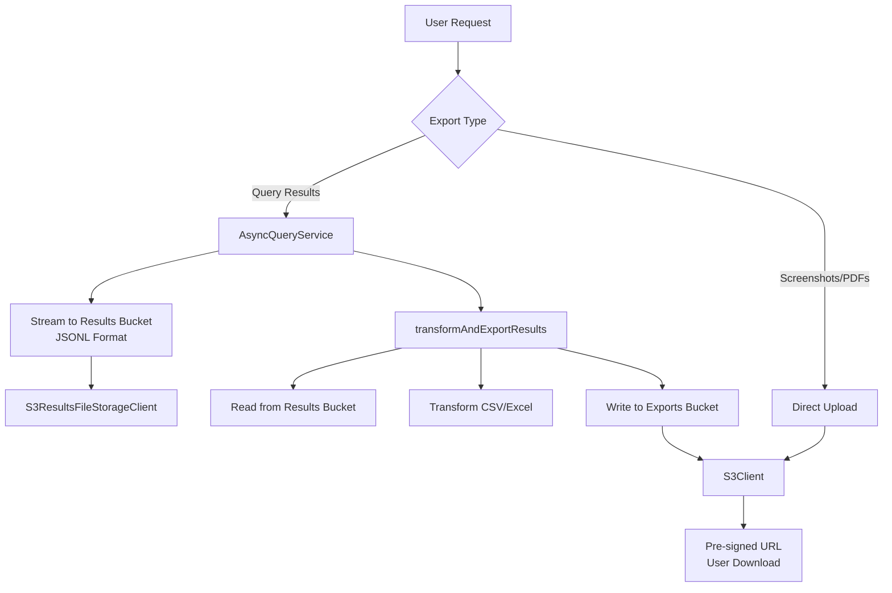

<summary>
AWS S3 storage clients for Lightdash backend. Provides two specialized S3 clients with distinct purposes: S3Client for user-facing file downloads (CSV/Excel exports, screenshots, scheduled deliveries) and S3ResultsFileStorageClient for query results in JSONL format.
</summary>

<howToUse>
Access S3 clients through the ClientRepository singleton pattern. The general S3Client is used for final exports and user downloads, while S3ResultsFileStorageClient is specifically for caching query results. Use transformAndExportResults() utility for cross-bucket transformations when converting cached results to user downloads.

```typescript
import { ClientRepository } from '../../clients/ClientRepository';

// Get S3 clients from repository
const clientRepository = new ClientRepository({ lightdashConfig });
const s3Client = clientRepository.getS3Client(); // General exports bucket
const resultsStorage = clientRepository.getS3ResultsFileStorageClient(); // Query cache bucket

// Upload user-facing files to general bucket
const csvUrl = await s3Client.uploadCsv(csvBuffer, 'report.csv');
const excelUrl = await s3Client.uploadExcel(fileStream, 'dashboard.xlsx');

// Store query results in JSONL format
const { write, close } = resultsStorage.createUploadStream(
    'query-results-123.jsonl',
    { contentType: 'application/jsonl' },
);
rows.forEach((row) => write([row]));
await close();

// Transform results from cache bucket to exports bucket
import { transformAndExportResults } from './transformAndExportResults';
const { fileUrl, truncated } = await transformAndExportResults(
    'query-results-123', // source in results bucket
    'export-report.csv', // destination in exports bucket
    async (readStream, writeStream) => {
        // Transform JSONL to CSV
        return { truncated: false };
    },
    {
        resultsStorageClient: resultsStorage,
        exportsStorageClient: s3Client,
    },
    {
        fileType: DownloadFileType.CSV,
        attachmentDownloadName: 'My Report.csv',
    },
);
```

</howToUse>

<codeExample>

```typescript
// Upload a CSV export for user download
const s3Client = clientRepository.getS3Client();
const csvUrl = await s3Client.uploadCsv(csvContent, 'sales-report-2025.csv');
// Returns pre-signed URL valid for 3 days (default config)

// Stream query results to cache bucket
const resultsStorage = clientRepository.getS3ResultsFileStorageClient();
const { write, close, writeStream } = resultsStorage.createUploadStream(
    'async-query-abc123.jsonl',
    { contentType: 'application/jsonl' },
);

// Write rows as JSONL
queryResults.forEach((row) => write([row]));
await close();

// Later, retrieve and stream cached results
const readStream = await resultsStorage.getDownloadStream('async-query-abc123');
// Process stream...

// Get pre-signed download URL for cached results
const downloadUrl = await resultsStorage.getFileUrl(
    'async-query-abc123',
    'jsonl',
);
```

Architecture diagram:



</codeExample>

<importantToKnow>
- **Two Buckets, Two Purposes**: S3Client uses S3_BUCKET env var (general exports), S3ResultsFileStorageClient uses RESULTS_S3_BUCKET (falls back to S3_BUCKET if not set)
- **Cross-Bucket Transforms**: Always use transformAndExportResults() utility to convert cached results to user downloads. Never write user-facing files to the results bucket
- **Authentication**: Both clients support IAM role credentials (preferred) or access key/secret key via env vars
- **Pre-signed URLs**: All uploads return pre-signed URLs with expiration times configured in lightdashConfig.s3.expirationTime
- **Streaming Support**: S3ResultsFileStorageClient provides createUploadStream() and S3Client provides createResultsExportUploadStream() for memory-efficient uploading
- **Content-Disposition**: File names in Content-Disposition headers are automatically set from filename parameter for proper browser downloads
- **File Extensions**: S3ResultsFileStorageClient automatically adds .jsonl extension if not present in filename
- **Base Class**: Both clients extend S3CacheClient which provides uploadResults(), getResults(), and getResultsMetadata() methods
</importantToKnow>

<links>
@/packages/backend/src/clients/Aws/S3Client.ts - General exports S3 client
@/packages/backend/src/clients/Aws/S3CacheClient.ts - Base S3 cache client
@/packages/backend/src/clients/ResultsFileStorageClients/S3ResultsFileStorageClient.ts - Query results storage
@/packages/backend/src/clients/Aws/S3CrossBucketTransform.ts - Cross-bucket transformation utility
@/packages/backend/src/clients/ClientRepository.ts - Client dependency injection
@/packages/backend/src/config/parseConfig.ts - S3 configuration settings
</links>
