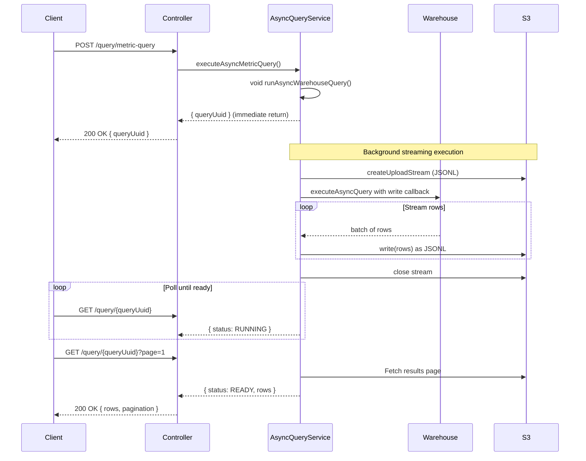

<summary>
AsyncQueryService handles asynchronous query execution against data warehouses. It uses a fire-and-forget pattern where execute methods start warehouse queries as void promises, return a `queryUuid` immediately, and clients poll for results. Results are streamed to S3 as JSONL during execution.

**Important**: While the API response is non-blocking (returns immediately), the actual query execution still runs on the main Node.js event loop and can block it during row processing for large result sets.

</summary>

<howToUse>
The service follows a two-phase pattern:

1. **Execute**: Call an execute method to start the query. The warehouse query runs as a void promise (`void this.runAsyncWarehouseQuery(...)`), returning `queryUuid` immediately.
2. **Poll**: Call `getAsyncQueryResults` with the `queryUuid` to fetch paginated results.

The QueryController exposes these operations via REST endpoints at `/api/v2/projects/{projectUuid}/query/`.
</howToUse>

<codeExample>

```typescript
// Phase 1: Execute a query (returns immediately, warehouse query runs in background)
const { queryUuid, cacheMetadata } =
    await asyncQueryService.executeAsyncMetricQuery({
        account: req.account,
        projectUuid: 'abc-123',
        metricQuery: {
            exploreName: 'orders',
            dimensions: ['order_date'],
            metrics: ['total_revenue'],
        },
        context: QueryExecutionContext.EXPLORE,
    });

// Phase 2: Poll for results using the queryUuid
const results = await asyncQueryService.getAsyncQueryResults({
    account: req.account,
    projectUuid: 'abc-123',
    queryUuid,
    page: 1,
    pageSize: 500,
});

// Check status - results may still be running
if (results.status === QueryHistoryStatus.READY) {
    console.log(results.rows); // Paginated data
}
```

</codeExample>



<importantToKnow>
**Fire-and-Forget Execution:**
The `executeAsyncQuery` method starts warehouse queries using `void this.runAsyncWarehouseQuery(...)`. Errors are caught internally and logged, not thrown to the caller.

**Streaming Results to S3:**
During execution, `runAsyncWarehouseQuery` creates an upload stream via `resultsStorageClient.createUploadStream()`. The warehouse client's `executeAsyncQuery` receives a `write` callback that streams rows as JSONL directly to S3 as they arrive from the warehouse.

**Event Loop Blocking (Known Issue):**
The streaming callback runs synchronously on the main thread. For each batch of rows:

1. For pivot queries: `rows.forEach()` loop does pivot transformations and Map operations
2. `write()` calls `JSON.stringify(row)` for every row (S3ResultsFileStorageClient:103)
3. `passThrough.push()` writes to the S3 stream synchronously

For queries returning millions of rows, this blocks the event loop during processing, affecting other requests on the same server instance.

**Execute Methods Available:**

-   `executeAsyncMetricQuery` - Metric queries with dimensions/metrics
-   `executeAsyncSavedChartQuery` - Saved chart execution
-   `executeAsyncDashboardChartQuery` - Chart within dashboard context
-   `executeAsyncUnderlyingDataQuery` - Drill-down into raw data
-   `executeAsyncSqlQuery` - Raw SQL execution
-   `executeAsyncSqlChartQuery` - Saved SQL chart
-   `executeAsyncDashboardSqlChartQuery` - SQL chart in dashboard context

**Query Status Values:**
`PENDING`, `RUNNING`, `READY`, `ERROR`, or `CANCELLED`

**Polling Results Source:**
When `getAsyncQueryResults` is called, results are fetched from different sources depending on configuration:

-   **S3 enabled** (`resultsStorageClient.isEnabled`): Reads paginated results from S3 JSONL file
-   **S3 disabled**: Falls back to `getResultsPageFromWarehouse()`, which re-queries the warehouse using stored `warehouseQueryId`. Currently only **Snowflake** supports this via `warehouseClient.getAsyncQueryResults()`. Other warehouses throw `NotImplementedError` and require S3 to be configured.

**Pagination:**
Results are paginated (default 500 rows, max 5000). Use `page` and `pageSize` parameters.
</importantToKnow>

<links>
@packages/backend/src/controllers/v2/QueryController.ts - REST API endpoints
@packages/backend/src/services/AsyncQueryService/types.ts - Type definitions for all execute args
@packages/backend/src/models/QueryHistoryModel/QueryHistoryModel.ts - Query state persistence
@packages/backend/src/clients/ResultsFileStorageClients/S3ResultsFileStorageClient.ts - S3 streaming client
</links>
