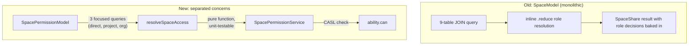

<summary>
Checks whether a user can perform actions on spaces (CASL permission checks).
Replaces the bloated `SpaceModel._getSpaceAccess` queries with a cleaner architecture
that separates access data fetching (SpacePermissionModel) from role resolution
(spaceAccessResolver) and permission checking (this service + CASL).
</summary>

<howToUse>

Access via `ServiceRepository.getSpacePermissionService()`.

Two main methods:

- `can(action, actor, spaceUuids)` - returns `true` if the actor can perform the action on **all** given spaces
- `getAccessibleSpaceUuids(action, actor, spaceUuids)` - filters a list of space UUIDs down to those the actor can access

Both methods resolve nested spaces to their root space for permission evaluation,
then delegate to CASL for the final check.

</howToUse>

<codeExample>

```typescript
const spacePermissionService = serviceRepository.getSpacePermissionService();

// Check if user can view a single space
const canView = await spacePermissionService.can('view', user, spaceUuid);

// Check if user can manage multiple spaces
const canManage = await spacePermissionService.can('manage', user, [
    spaceUuid1,
    spaceUuid2,
]);

// Filter to only accessible spaces
const accessible = await spacePermissionService.getAccessibleSpaceUuids(
    'view',
    user,
    allSpaceUuids,
);
```

</codeExample>

<importantToKnow>

- **Nested spaces inherit from root**: Permissions are always evaluated on the root space.
  `SpaceModel.getSpaceRootFromCacheOrDB` resolves child spaces to their root (cached 30s).
- **Data flow**: `SpacePermissionModel` fetches raw access rows from 3 layers (direct, project, org)
  -> `resolveSpaceAccess` computes effective roles per user -> CASL checks the final permission.
- **Not yet wired up**: This service is registered in `ServiceRepository` but not consumed by
  any controller or other service yet. It's the intended replacement for inline permission
  checks that use `SpaceModel._getSpaceAccess`.
- **`isPrivate` is derived from the inheritance chain**: The `isPrivate` boolean passed to
  `resolveSpaceAccess` will be replaced by `inheritsFromOrgOrProject` (inverted), computed by
  `SpacePermissionModel.getInheritanceChain()`. See
  @packages/common/src/authorization/space/AGENTS.md for the full mental model and mapping.

**Why the old approach (`SpaceModel`) was bad:**

The legacy access methods (`_getSpaceAccess`, `_getSpaceAccessWithProjectAndOrgInheritance`,
`_getDirectSpaceAccessOnly`) lived in `SpaceModel` and had several problems:

1. **Monolithic queries**: Each method is a single 9-table LEFT JOIN query (~180 lines of Knex)
   that fetches org, project, group, and direct access in one pass. Hard to read, debug, or
   modify without risking regressions in unrelated permission paths.
2. **Duplicated role resolution**: The `highestRole` / `spaceRole` computation is copy-pasted
   across `_getSpaceAccess` and `_getSpaceAccessWithProjectAndOrgInheritance` as inline
   `.reduce()` logic (~80 lines each). Fixing a role resolution bug meant patching it in
   multiple places.
3. **Untestable**: Role resolution was embedded in the model's post-query JS, tightly coupled
   to the DB row shape. You couldn't unit test "given these access records, what role does the
   user get?" without hitting the database.
4. **Wrong layer**: A data model was making authorization decisions (filtering out private space
   users, computing admin overrides). This mixed data access with business logic.

**How the new architecture fixes it:**



- **SpacePermissionModel**: Only fetches raw access rows. Each query targets one access layer
  with simple JOINs (2-4 tables each). Easy to understand and optimize independently.
- **resolveSpaceAccess** (in `common`): Pure function that computes effective roles. Fully
  unit-testable with no DB dependency.
  See @packages/common/src/authorization/space/spaceAccessResolver.test.ts.
- **SpacePermissionService**: Orchestrates the flow and delegates the final check to CASL.
  Keeps authorization logic in the service layer where it belongs.

</importantToKnow>

<links>

- Access resolver logic and tests: @packages/common/src/authorization/space/spaceAccessResolver.ts
- Raw access queries: @packages/backend/src/models/SpacePermissionModel.ts
- Legacy access queries (being replaced): @packages/backend/src/models/SpaceModel.ts (`_getSpaceAccess`, `getEffectiveSpaceAccess`)
- CASL permission system: use `/ld-permissions` skill for full guide
- Service registration: @packages/backend/src/services/ServiceRepository.ts

</links>
