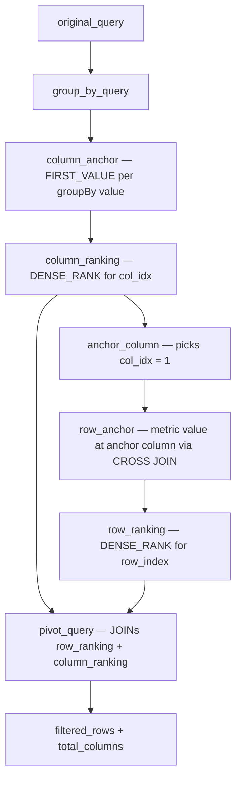

<summary>
SQL generation and transformation utilities for Lightdash queries.
Three main builders: MetricQueryBuilder (metrics/dimensions with joins), PivotQueryBuilder (flat → pivot table with row/column indexes), SqlQueryBuilder (SQL charts with filtering).
PivotQueryBuilder does NOT pivot data — it generates SQL that tags each row with `row_index` and `column_index` metadata via DENSE_RANK(). The actual pivoting happens downstream in AsyncQueryService.runQueryAndTransformRows.
</summary>

<howToUse>

**MetricQueryBuilder** — builds the base SQL from an Explore + MetricQuery (dimensions, metrics, filters, joins, table calculations). Handles fan-out protection via CTEs and period-over-period comparisons.

```typescript
import { MetricQueryBuilder } from './MetricQueryBuilder';

const builder = new MetricQueryBuilder({
    explore,
    compiledMetricQuery,
    warehouseSqlBuilder,
    userAttributes,
    intrinsicUserAttributes,
    parameters,
    parameterDefinitions,
    timezone,
});
const { query, fields, warnings } = builder.buildQuery();
```

**PivotQueryBuilder** — wraps a flat SQL query and adds `row_index` / `column_index` metadata for pivot table rendering.

```typescript
import { PivotQueryBuilder } from './PivotQueryBuilder';

const pivotBuilder = new PivotQueryBuilder(
    query, // flat SQL (typically from MetricQueryBuilder)
    pivotConfiguration, // { indexColumn, valuesColumns, groupByColumns, sortBy }
    warehouseSqlBuilder,
    limit,
    itemsMap,
);
const sql = pivotBuilder.toSql({ columnLimit: 100 });
```

**SqlQueryBuilder** — builds queries for SQL charts (user-written SQL with filters and parameter replacement).

```typescript
import { SqlQueryBuilder } from './SqlQueryBuilder';

const builder = new SqlQueryBuilder(
    {
        referenceMap,
        select,
        from: { name, sql: userSql },
        filters,
        parameters,
        limit,
    },
    warehouseConfig,
);
const { sql, parameterReferences } = builder.getSqlAndReferences();
```

</howToUse>

<importantToKnow>

**Three CTE pipeline modes** depending on configuration:

1. **Simple** (no groupByColumns): `original_query → group_by_query → SELECT with ORDER BY + LIMIT`. No pivoting, no row/column indexes.

2. **Dimension sort** (groupByColumns present, sorting by dimension/index columns): `original_query → group_by_query → pivot_query → filtered_rows → total_columns`. `pivot_query` computes `row_index` and `column_index` inline with DENSE_RANK. No anchor CTEs.

3. **Metric sort** (sorting by a value column): Full anchor CTE pipeline:



**Metric sorting anchor system**: When users sort by a metric, rows are ordered by that metric's value in the _first pivot column only_ (the anchor column), not by MIN/MAX across all columns. The anchor column is determined by `column_ranking` (`col_idx = 1`).

**Precomputed rankings for Databricks/Spark**: Databricks inlines CTEs instead of materializing them. When `pivot_query` had inline DENSE_RANK with anchor column references, Spark couldn't resolve them across the inlined CTE boundary. Fix: `row_ranking` and `column_ranking` are self-contained CTEs with their own JOINs; `pivot_query` just JOINs the precomputed results. This activates automatically when metric sorting + index columns are present.

**CTE name quoting**: Anchor CTE names are derived from field names (e.g., `revenue_column_anchor`). Since field names can contain spaces, all dynamic CTE names must be quoted with `${q}${cteName}${q}`. Hardcoded CTE names (`row_ranking`, `pivot_query`, etc.) don't need quoting.

**Two-phase pivot**: PivotQueryBuilder outputs rows tagged with `row_index` + `column_index`. The actual pivot (spreading values into `{field}_{aggregation}_{groupByValue}` columns) happens in `AsyncQueryService.runQueryAndTransformRows` which streams results and pivots on `row_index` changes.

</importantToKnow>

<links>

- @/packages/backend/src/services/AsyncQueryService/AsyncQueryService.ts — Query execution and pivot result streaming
- @/packages/backend/src/utils/QueryBuilder/PivotQueryBuilder.test.ts — PivotQueryBuilder tests (all CTE paths)
- @/packages/backend/src/utils/QueryBuilder/MetricQueryBuilder.test.ts — MetricQueryBuilder tests
- @/packages/backend/src/utils/QueryBuilder/parameters.ts — Parameter replacement (safe + raw modes)
- @/packages/backend/src/utils/QueryBuilder/utils.ts — SQL parsing, sort helpers, join utilities
- @/packages/warehouses/src/warehouseSqlBuilder.ts — Dialect-specific SQL builders
- @/packages/common/src/types/pivot.ts — PivotConfiguration types

</links>
