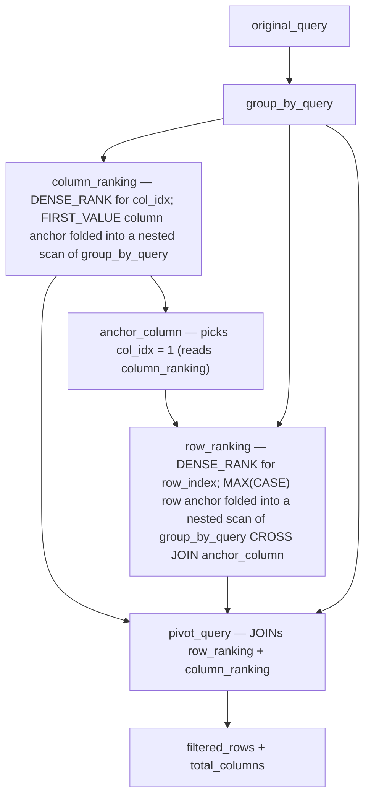

<summary>
SQL generation and transformation utilities for Lightdash queries.
Facade: QueryComposer (orchestrates context prep + the builders below to own metric SQL generation end-to-end) and its subclass SqlQueryComposer (folds SQL charts into the same facade — wraps user-written SQL instead of compiling a metric query, sharing one getSql() pivot seam).
Four builders: MetricQueryBuilder (metrics/dimensions with joins), PivotQueryBuilder (flat → pivot table with row/column indexes), SqlQueryBuilder (SQL charts with filtering), TotalQueryBuilder (source query → grand/row/column/subtotal query transform).
PivotQueryBuilder does NOT pivot data — it generates SQL that tags each row with `row_index` and `column_index` metadata via DENSE_RANK(). The actual pivoting happens downstream in AsyncQueryService.runQueryAndTransformRows.

This file covers SQL generation only. For the end-to-end pivot pipeline (config → SQL → transform → reshape → render), see `/docs/pivoting.md`.
</summary>

<howToUse>

**QueryComposer** — the facade to reach for when you have a `MetricQuery` (+ optional `PivotConfiguration`) and want SQL. It owns the context prep internally — reserved-parameter merge, date-zoom explore rewrite, `compileMetricQuery` — then orchestrates `MetricQueryBuilder` and `PivotQueryBuilder`. It does not generate SQL itself. Prefer this over wiring the builders by hand. Construct it directly at the call site.

```typescript
import { QueryComposer } from './QueryComposer';

const composer = new QueryComposer(
    {
        metricQuery,
        pivotConfiguration, // undefined for a flat query
        totalConfiguration, // undefined unless building a totals query (see below)
    },
    {
        explore,
        warehouseSqlBuilder,
        intrinsicUserAttributes,
        userAttributes,
        timezone,
        availableParameterDefinitions,
        parameters,
        dateZoom,
        pivotDimensions,
        // pivotItemsMap overrides the itemsMap the pivot resolves against
        // (defaults to the freshly compiled fields) — pre-agg passes the
        // source query's persisted fields.
        pivotItemsMap,
        continueOnError,
        useTimezoneAwareDateTrunc,
        columnTimezone,
        applyDateZoomToFilters,
    },
);

const compiled = composer.compile(); // memoized CompiledQuery (base SQL, fields, warnings, params)
const sql = composer.getSql({ columnLimit }); // PivotQueryBuilder-wrapped when pivotConfiguration is set, else base
```

`compile()` delegates to a protected `computeCompiled()` template-method seam (memoized). Subclasses override `computeCompiled()` to build the base `CompiledQuery` from different inputs; the pivot pipeline (`getSql`) is inherited unchanged.

**Getter surface.** The composer is the single carrier of query/context data through the async execute seam — `AsyncQueryService.executePreparedAsyncQuery` reads everything (explore, metric query, fields, pivot, timezones, parameters, access controls) off `get*()` getters instead of loose args. Non-obvious ones: `getFields()` applies metric/dimension format overrides from the **source** query, `getParameters()` returns the raw combined values (not the reserved-merged compile variant), and `getDisplayTimezone()` is a context carry (not a compile input) that SQL charts pin to `null`.

**Totals mode.** Set `totalConfiguration: { kind, subtotalDimensions }` on the
definition to build a totals query. The composer just forwards it —
**totals are entirely `MetricQueryBuilder`'s job**: in its constructor the
builder collapses the (compiled) source query + pivot config into the requested
grain (`grandTotal`/`columnTotal`/`rowTotal`/`columnSubtotal`/`rowSubtotal`) via
`TotalQueryBuilder`, compiles the collapsed query internally, and keeps the
original around as the embedded source where needed. The effective (collapsed)
query/pivot are exposed via the builder's `getEffectiveMetricQuery()` /
`getEffectivePivotConfiguration()`; the composer's `getMetricQuery()` /
`getPivotConfiguration()` delegate to them so routing / request echo / response
use the collapsed form. Date zoom stays inert here — it targets the source
query's dimensions, which the collapsed totals query typically no longer selects.
This is what the calculate-total path (`executeAsyncCalculateTotalFromQueryHistory`)
uses instead of hand-collapsing at the call site.

`totalConfiguration` and `dashboardFilters` are mutually exclusive. Totals
replay a query already persisted in query history; applying the source
dashboard filters again would change its semantics. `AsyncQueryService` asserts
this invariant at the `executeAsyncMetricQuery` entry point before preparing a
composer.

**Computing on top of the source query.** Totals sometimes need the *original*
query's results, not just its collapsed form. In totals mode the builder keeps
the original compiled query as its internal `sourceQuery`, embeds it ONCE as a
top-level `source_rows` CTE (its body may itself contain a `WITH` chain — same
production-proven pattern as PivotQueryBuilder's `original_query`; the
sub-compile via `compileQueryAsCteBody()` omits ORDER BY / LIMIT and skips
parameter replacement so the outer query's single replacement pass covers both
texts) and derives what to compute on top (`deriveSourceQueryUses`) from the
totals kind and the two queries. Every use derives from that one embed; new
"calculate on top of the original query" features should extend the derivation
rather than add another embed:

- **`groupRestrictions`** — each entry derives a `SELECT DISTINCT <join dims>`
  CTE (`source_dimension_groups`, or `visible_dimension_groups` over
  `visible_page_rows` = `source_rows` + the source's ORDER BY/LIMIT for scope
  `'visiblePage'`) and appends an `INNER JOIN` on null-safe equality
  (`getNullSafeEqualJoinSql`) to `dimensionsSQL.joins`, which reaches every raw
  scan (fan-out, distinct-metric, nested-aggregate and totals CTEs). DISTINCT
  makes the join fan-out-free at any grain. Custom bin join dimensions not
  selected by the totals query get their min/max CTE + CROSS JOIN added.
  Uses: scope `'results'` enforces metric / table-calc filters (PROD-8431 —
  they compile to a post-aggregation WHERE at the source grain, so the
  collapsed totals query strips them and restricts raw rows instead; totals
  stay exact for every metric type since aggregation still runs over raw
  rows). Scope `'visiblePage'` pins subtotals to the page the user sees
  (PROD-7570 — the subtotal response covers exactly the rendered grain groups,
  so its inherited row limit can never truncate one; subtotal *values* stay
  full-group aggregates).
- **`aggregations`** — aggregates source-row columns at the totals grain in a
  `source_aggregations` CTE (grain columns prefixed `sa_` to avoid alias
  collisions), forces the post-agg CTE path, and LEFT JOINs (CROSS JOIN at the
  grand grain) the results onto the final select. Used for table calcs with
  `totalMode: 'sum_of_rows'` (PROD-8594): their totals are SUMs of row-level
  values, which also gives correct totals to calcs that can't be re-applied to
  a collapsed row (window functions, templates). The `'formula'` default keeps
  the existing re-apply behavior; `'none'` opts the calc out of totals entirely
  (dropped from the collapsed query, never aggregated). Persisted per-calc in
  `saved_queries_version_table_calculations.total_mode`.

**SqlQueryComposer** — the facade for SQL charts (`extends QueryComposer`). SQL charts run user-written SQL rather than compiling a metric query, so this builds everything from raw inputs — the virtual view (`createVirtualView`) from the discovered columns, the wrapping `SqlQueryBuilder` (reference map + dialect config off the warehouse client), a mock `MetricQuery` metadata carrier, and (on the dashboard path) the applied dashboard filters/sorts — then overrides `computeCompiled()` to shape the wrapped user SQL into a `CompiledQuery`. Because `getSql()` is inherited, a request/config `pivotConfiguration` flows through the same seam as metric queries. Used by `AsyncQueryService.prepareSqlChartAsyncQueryArgs` for all three SQL execute paths (raw SQL runner, saved SQL chart, dashboard SQL chart).

```typescript
import { SqlQueryComposer } from './SqlQueryComposer';

const composer = new SqlQueryComposer({
    userSql, // user SQL with user attributes already replaced
    columns, // discovered via a LIMIT 1 probe query
    warehouseClient,
    pivotConfiguration, // request-supplied (SQL runner) or derived from chart config
    limit,
    parameters,
    dashboardFilters, // dashboard SQL-chart path only
    tileUuid,
    dashboardSorts,
});

const compiled = composer.compile(); // wrapped user SQL as base CompiledQuery
const sql = composer.getSql({ columnLimit }); // pivot-wrapped when pivotConfiguration is set
const metricQuery = composer.getMetricQuery(); // mock metadata carrier (echoed to the client)
const virtualView = composer.getExplore();
const appliedDashboardFilters = composer.getAppliedDashboardFilters();
```

**dateZoom util.** `updateExploreWithDateZoom` is the single explore-rewrite
step used by `QueryComposer`. It takes the source explore/query, warehouse SQL
builder, available parameter names, and optional `DateZoom`; then returns the
effective explore plus `dateZoomApplied` and `dateZoomTargetFieldId` metadata.
The rewrite changes the target date dimension's SQL to the selected grain while
preserving the source explore for field lookup. By default it affects selected
dimensions only. Set `applyDateZoomToFilters` only for the underlying-data path,
where the matching click-filter must compile against the rewritten expression.
Callers should pass `dateZoom` into the composer instead of invoking this util
or mutating an explore themselves.

**MetricQueryBuilder** — builds the base SQL from an Explore + MetricQuery (dimensions, metrics, filters, joins, table calculations). Handles fan-out protection via CTEs and period-over-period comparisons. Usually driven via `QueryComposer` rather than constructed directly.

```typescript
import { MetricQueryBuilder } from './MetricQueryBuilder';

const builder = new MetricQueryBuilder({
    explore,
    compiledMetricQuery,
    warehouseSqlBuilder,
    userAttributes,
    intrinsicUserAttributes,
    parameters,
    parameterDefinitions,
    timezone,
});
const { query, fields, warnings } = builder.buildQuery();
```

**PivotQueryBuilder** — wraps a flat SQL query and adds `row_index` / `column_index` metadata for pivot table rendering.

```typescript
import { PivotQueryBuilder } from './PivotQueryBuilder';

const pivotBuilder = new PivotQueryBuilder(
    query, // flat SQL (typically from MetricQueryBuilder)
    pivotConfiguration, // { indexColumn, valuesColumns, groupByColumns, sortBy }
    warehouseSqlBuilder,
    limit,
    itemsMap,
);
const sql = pivotBuilder.toSql({ columnLimit: 100 });
```

**SqlQueryBuilder** — builds queries for SQL charts (user-written SQL with filters and parameter replacement).

```typescript
import { SqlQueryBuilder } from './SqlQueryBuilder';

const builder = new SqlQueryBuilder(
    {
        referenceMap,
        select,
        from: { name, sql: userSql },
        filters,
        parameters,
        limit,
    },
    warehouseConfig,
);
const { sql, parameterReferences } = builder.getSqlAndReferences();
```

**TotalQueryBuilder** — transforms a source query (`metricQuery` + `pivotConfiguration`) into the totals query that reproduces a requested grain (`grandTotal` / `columnTotal` / `rowTotal` / `columnSubtotal` / `rowSubtotal`). It does NOT emit SQL — it returns a transformed `MetricQuery` + `PivotConfiguration` that is then executed through the normal path (`MetricQueryBuilder` / `PivotQueryBuilder`). Mirrors `MetricQueryBuilder`'s surface: configure via the constructor, then call `compileQuery()`. Used by `AsyncQueryService` to compute table-calc/metric totals for a previously-executed query.

```typescript
import { TotalQueryBuilder } from './TotalQueryBuilder';

const { metricQuery, pivotConfiguration } = new TotalQueryBuilder({
    metricQuery: source.metricQuery,
    pivotConfiguration: source.pivotConfiguration, // or null
    kind: 'columnTotal',
    subtotalDimensions, // required for subtotal kinds
}).compileQuery();
```

</howToUse>

<importantToKnow>

**Three CTE pipeline modes** depending on configuration:

1. **Simple** (no groupByColumns): `original_query → group_by_query → SELECT with ORDER BY + LIMIT`. No pivoting, no row/column indexes.

2. **Dimension sort** (groupByColumns present, sorting by dimension/index columns): `original_query → group_by_query → pivot_query → filtered_rows → total_columns`. `pivot_query` computes `row_index` and `column_index` inline with DENSE_RANK. No anchor CTEs.

3. **Metric sort** (sorting by a value column): anchor windows folded into the ranking CTEs:


```mermaid
graph TD
    A[original_query] --> B[group_by_query]
    B --> D["column_ranking — DENSE_RANK for col_idx; FIRST_VALUE column anchor folded into a nested scan of group_by_query"]
    D --> E["anchor_column — picks col_idx = 1 (reads column_ranking)"]
    E --> G["row_ranking — DENSE_RANK for row_index; MAX(CASE) row anchor folded into a nested scan of group_by_query CROSS JOIN anchor_column"]
    B --> G
    D --> H["pivot_query — JOINs row_ranking + column_ranking"]
    G --> H
    B --> H
    H --> I[filtered_rows + total_columns]
```

**Metric sorting anchor system**: When users sort by a metric, rows are ordered by that metric's value in the _first pivot column only_ (the anchor column), not by MIN/MAX across all columns. The anchor column is determined by `column_ranking` (`col_idx = 1`).

**Anchors folded into rankings (PROD-8441)**: The column anchor (`FIRST_VALUE` per groupBy value, aliased `${ref}_ca_value`) and row anchor (`MAX(CASE …)` metric value at the anchor column, aliased `${ref}_ra_value`) are computed inside a nested subquery (aliased `g`) within `column_ranking` / `row_ranking` respectively — not as standalone `{ref}_ca` / `{ref}_ra` CTEs. This keeps `group_by_query` referenced ~3× on the metric-sort path (once per nested anchor scan + once by `pivot_query`) instead of ~6×, which matters on inlining engines like Trino (`query.max-stage-count`). It is also more robust for Databricks/Spark: the anchor value lives in the same scan as the ranking Window, so there is no cross-CTE column reference for an inliner to lose. `anchor_column` (and the per-metric `{ref}_anchor_column` pinned variant) stays its own CTE — it reads `column_ranking`, not `group_by_query`.

**Precomputed rankings for Databricks/Spark**: Databricks inlines CTEs instead of materializing them. When `pivot_query` had inline DENSE_RANK with anchor column references, Spark couldn't resolve them across the inlined CTE boundary. Fix: `row_ranking` and `column_ranking` are self-contained CTEs (each folding its own anchor scan); `pivot_query` just JOINs the precomputed results. This activates automatically when metric sorting + index columns are present.

**Single-scan addendum (warehouses without CTE materialization)**: Some engines (Trino, Athena) never materialize a CTE, so each reference to `group_by_query` re-runs its whole lineage (base scan + filters + GROUP BY) — the 3-CTE precomputed form references it 3× and so scans the base ~4 times. On the metric-sort path these engines instead collapse `column_ranking` + `anchor_column` + `row_ranking` into a single self-contained `pivot_query` that scans `group_by_query` **once**: the column anchor, column rank, row anchor and row rank become a stack of window functions over one nested scan rather than separate CTEs joined back together. It's equivalent because each anchor value is constant within its combo, so dropping the `SELECT DISTINCT` leaves the ranks unchanged. Gated on a capability — `warehouseSqlBuilder.supportsCteMaterialization()` returning false — not on the adapter type; it defaults to true, so every other dialect (including Databricks/Spark, which reuses its computed CTE result) keeps the 3-CTE form unchanged.

**Anchor value aliasing**: The folded anchor value columns keep the `${ref}_ca_value` / `${ref}_ra_value` aliases (resolved against the nested derived table `g`). The `_ca`/`_ra` suffixes are kept short to stay within Postgres' 63-char identifier limit when field references are long. Hardcoded CTE names (`row_ranking`, `pivot_query`, etc.) don't need quoting.

**Two-phase pivot**: PivotQueryBuilder outputs rows tagged with `row_index` + `column_index`. The actual pivot (spreading values into `{field}_{aggregation}_{groupByValue}` columns) happens in `AsyncQueryService.runQueryAndTransformRows` which streams results and pivots on `row_index` changes.

</importantToKnow>

<links>

- @/packages/backend/src/utils/QueryBuilder/QueryComposer.ts — Facade that owns metric SQL generation end-to-end
- @/packages/backend/src/utils/QueryBuilder/SqlQueryComposer.ts — SQL-chart subclass of the facade (wraps user SQL)
- @/packages/backend/src/utils/QueryBuilder/dateZoom.ts — Date-zoom explore rewrite used by QueryComposer
- @/packages/backend/src/services/AsyncQueryService/AsyncQueryService.ts — Query execution and pivot result streaming
- @/packages/backend/src/utils/QueryBuilder/PivotQueryBuilder.test.ts — PivotQueryBuilder tests (all CTE paths)
- @/packages/backend/src/utils/QueryBuilder/MetricQueryBuilder.test.ts — MetricQueryBuilder tests
- @/packages/backend/src/utils/QueryBuilder/parameters.ts — Parameter replacement (safe + raw modes)
- @/packages/backend/src/utils/QueryBuilder/utils.ts — SQL parsing, sort helpers, join utilities
- @/packages/warehouses/src/warehouseSqlBuilder.ts — Dialect-specific SQL builders
- @/packages/common/src/types/pivot.ts — PivotConfiguration types

</links>
