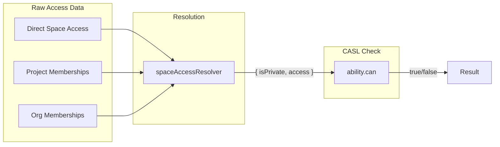

<summary>
This module handles authorization for Lightdash using CASL (Code Access Security Layer).
It defines what actions users can perform based on their roles at organization, project, and space levels.

The key components are:

- **Ability builders**: Create CASL abilities based on user roles
- **Space access resolver**: Computes effective space roles from multiple access sources
- **Scope-based abilities**: Support for custom roles with fine-grained permissions
  </summary>

<howToUse>

## Building User Abilities

Use `getUserAbilityBuilder` to create a CASL ability for a user:

```typescript
import { getUserAbilityBuilder } from '@lightdash/common';

const builder = getUserAbilityBuilder({
    user: { role: 'editor', organizationUuid, userUuid },
    projectProfiles: [{ projectUuid, role: 'editor', userUuid }],
    permissionsConfig: { pat: { enabled: false, allowedOrgRoles: [] } },
});
const ability = builder.build();
```

## Checking Permissions

Use CASL's `can` method with `subject()` to check permissions:

```typescript
import { subject } from '@casl/ability';

// Check if user can view a space
ability.can(
    'view',
    subject('Space', {
        projectUuid,
        isPrivate: false,
        access: [{ userUuid, role: 'editor' }],
    }),
);
```

## Resolving Space Access

Use `resolveSpaceAccessForCasl` to compute effective access from raw data:

```typescript
import { resolveSpaceAccessForCasl } from '@lightdash/common';

const accessForCasl = resolveSpaceAccessForCasl({
    directAccess, // Direct space user/group access
    projectAccess, // Project membership access
    organizationAccess, // Org membership access
    isPrivate: true,
});
// Returns: { isPrivate, access: [{ userUuid, role }] }
```

</howToUse>

<codeExample>



</codeExample>

<importantToKnow>
- **spaceAccessResolver** computes "what role does user have" - CASL checks "can user do action with that role"
- Space access is resolved from the **root space** for nested spaces (access is inherited)
- For **public spaces**: users get access based on their project role (converted to space role)
- For **private spaces**: users need direct access (user or group) to have any access
- Role priority: admin > editor > viewer - the resolver returns the highest effective role
- CASL uses `$elemMatch` to check if a user is in the access array with a specific role
</importantToKnow>

<links>
- CASL documentation: https://casl.js.org/v6/en/guide/intro
- Organization abilities: @/packages/common/src/authorization/organizationMemberAbility.ts
- Project abilities: @/packages/common/src/authorization/projectMemberAbility.ts
- Scope-based abilities: @/packages/common/src/authorization/scopeAbilityBuilder.ts
- Space access resolver: @/packages/common/src/authorization/spaceAccessResolver.ts
- Backend permission model: @/packages/backend/src/models/SpacePermissionModel.ts
</links>
