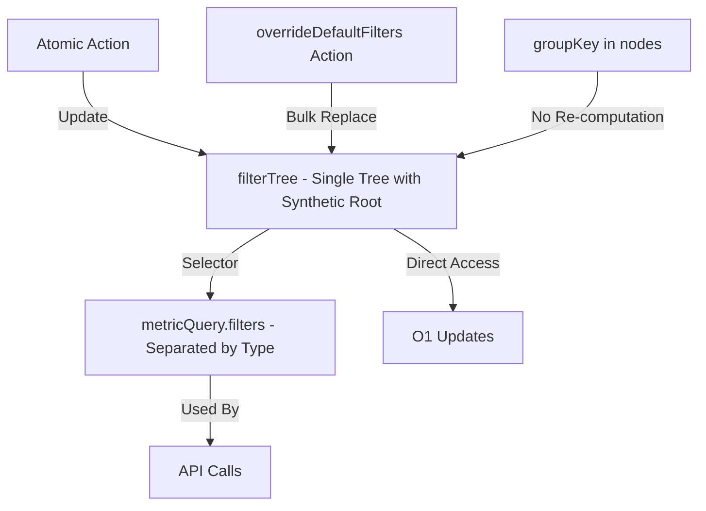

# Explorer Store - Filter Management

<summary>
Redux store slice for managing explorer state with single normalized filter tree architecture. Provides atomic filter updates via flat tree structure with synthetic root, while maintaining backward compatibility with nested filter API format.

**Key Concept:** Filters are managed in two representations - a single flat normalized tree with synthetic root (source of truth) and a nested structure (computed for API calls). The flat structure enables O(1) filter access, atomic updates without tree traversal, and supports mixing filter types at root level.

</summary>

## Architecture Overview

### Single Tree with Synthetic Root

**1. Nested Structure (`metricQuery.filters`)**

-   Traditional recursive FilterGroup tree separated by type
-   Used for API calls and backward compatibility
-   Example: `{ dimensions: { and: [rule1] }, metrics: { and: [rule2] } }`
-   **Computed from filterTree** via selectors (not stored separately)

**2. Normalized Tree (`state.filterTree`)**

-   **Single unified tree** with synthetic root node
-   Flat structure with `byId` lookup for O(1) access
-   **groupKey stored in rule nodes** - no re-computation needed!
-   Synthetic root allows mixing dimensions/metrics/tableCalculations
-   Example: `{ byId: { 'root': { type: 'group', childIds: ['rule1', 'rule2'] }, 'rule1': { type: 'rule', groupKey: 'dimensions', ... } }, rootId: 'root' }`
-   Stored in: `state.filterTree`

### How They Work Together



-   `filterTree` is the **single source of truth**
-   Selectors automatically denormalize and separate `filterTree` → `metricQuery.filters`
-   When you update `filterTree`, `metricQuery.filters` updates automatically
-   **groupKey stored once** in rule nodes - never recomputed
-   No manual sync needed!

<importantToKnow>

**When to use atomic actions:**

-   Single filter rule updates (operator, value changes)
-   Adding/removing individual filters
-   Reordering filters (drag-and-drop)
-   Toggling AND/OR operators
-   Deep nested updates (no traversal needed)

**When to use overrideDefaultFilters:**

-   Setting default/required filters on load
-   Replacing entire filter structure
-   Loading saved filters from API

**Architecture Benefits:**

-   **No groupKey needed for most operations** - it's stored in the node!
-   O(1) access to any filter by ID (vs O(n) tree traversal)
-   Efficient updates without copying entire tree
-   Works perfectly with immer for immutable updates
-   **Supports mixed root groups** - dimensions + metrics at same level
-   Scalable for deep nesting and large filter sets

**Gotchas:**

-   **IMPORTANT:** Use `selectFilterTree` for UI rendering, `selectDenormalizedFiltersForApi` for API calls
-   Don't manually manipulate `metricQuery.filters` - it's computed from `filterTree`
-   Only two actions need groupKey:
    -   `addFilterRuleFromField` - automatically determines it from the field object
    -   `addFilterRuleToTree` - requires it as a parameter
-   All other actions (update, remove, move, toggle, convert) read groupKey from the node itself

**Selector Usage Guidelines:**

| Selector                          | When to Use                                                                                   | DON'T Use For                                              |
| --------------------------------- | --------------------------------------------------------------------------------------------- | ---------------------------------------------------------- |
| `selectFilterTree`                | ✅ UI rendering (FiltersCard, FilterGroupForm)<br>✅ Filter state checks<br>✅ Tree traversal | ⚠️ API calls (wrong format)                                |
| `selectDenormalizedFiltersForApi` | ✅ Running queries<br>✅ Compiling SQL<br>✅ Saving charts                                    | ⚠️ UI rendering (creates new objects, triggers re-renders) |
| `selectMetricQueryForApi`         | ✅ Complete query for API                                                                     | ⚠️ Most UI components (use separate selectors)             |

</importantToKnow>

<howToUse>
**Import actions, hooks, and selectors:**
```typescript
import {
    explorerActions,
    useExplorerSelector,
    useExplorerDispatch
} from '@/features/explorer/store';
import {
    selectFilterTree,
    selectDenormalizedFiltersForApi
} from '@/features/explorer/store/selectors';
```

**Access filter state:**

```typescript
const dispatch = useExplorerDispatch();

// ✅ For UI rendering (FiltersCard, filter components)
const filterTree = useExplorerSelector(selectFilterTree);

// ✅ For API calls (queries, SQL compilation, saving)
const filters = useExplorerSelector(selectDenormalizedFiltersForApi);
```

**Note:** `useExplorerDispatch` and `useExplorerSelector` are typed versions of React Redux hooks specifically for the explorer store.

</howToUse>

<codeExample>

**Update a filter rule (atomic O(1) operation - no groupKey needed!):**

```typescript
import { FilterOperator } from '@lightdash/common';

dispatch(
    explorerActions.updateFilterRuleInTree({
        ruleId: 'filter-id-123',
        updates: {
            operator: FilterOperator.EQUALS,
            values: ['new value'],
        },
    }),
);
```

**Add a filter from field selection (e.g., "Add filter" button):**

```typescript
dispatch(
    explorerActions.addFilterRuleFromField({
        field: fieldObject, // Dimension, Metric, or TableCalculation
        value: undefined, // Optional initial value
    }),
);
// This automatically determines groupKey from the field and adds to root level
```

**Add a new filter to a specific parent group (groupKey required for new nodes):**

```typescript
import { createFilterRuleFromField } from '@lightdash/common';

dispatch(
    explorerActions.addFilterRuleToTree({
        groupKey: 'dimensions', // Required when creating new node
        parentId: 'group-id-456',
        rule: createFilterRuleFromField(field),
        index: 2, // Optional: insert at specific position
    }),
);
```

**Remove a filter (no groupKey needed - it's in the node!):**

```typescript
dispatch(
    explorerActions.removeFilterRuleFromTree({
        ruleId: 'filter-id-123',
    }),
);
```

**Reorder filters (drag-and-drop - no groupKey needed!):**

```typescript
dispatch(
    explorerActions.moveFilterRuleInTree({
        ruleId: 'filter-id-123',
        newParentId: 'group-id-456',
        index: 2,
    }),
);
```

**Set AND/OR operator (no groupKey needed!):**

```typescript
import { FilterGroupOperator } from '@lightdash/common';

dispatch(
    explorerActions.setFilterGroupOperator({
        groupId: 'group-id-456',
        operator: FilterGroupOperator.or, // or FilterGroupOperator.and
    }),
);
```

**Convert a filter rule to a group (no groupKey needed - copied from rule!):**

```typescript
import { FilterGroupOperator } from '@lightdash/common';

// Converts a single filter rule into a group containing that rule
// Useful for building complex nested filter logic
dispatch(
    explorerActions.convertFilterRuleToGroup({
        ruleId: 'filter-id-123',
        newGroupOperator: FilterGroupOperator.or, // or FilterGroupOperator.and
    }),
);
```

**Clear all filters:**

```typescript
dispatch(explorerActions.resetFilterTree());
```

**Set default/required filters (bulk operation):**

```typescript
dispatch(
    explorerActions.overrideDefaultFilters({
        dimensions: { and: [rule1, rule2] },
        metrics: undefined,
        tableCalculations: undefined,
    }),
);
```

</codeExample>

<links>
**Related Files:**
- Filter tree utilities (normalize/denormalize): `./filterTree.ts`
- Redux slice with actions: `./explorerSlice.ts`
- Selectors for accessing state: `./selectors.ts`
- Typed Redux hooks: `./hooks.ts`
- Store configuration and exports: `./index.ts`

**External References:**

-   Filter types and utilities: `@lightdash/common` (`packages/common/src/types/filter.ts`)
-   Redux state normalization pattern: https://redux.js.org/usage/structuring-reducers/normalizing-state-shape
    </links>
