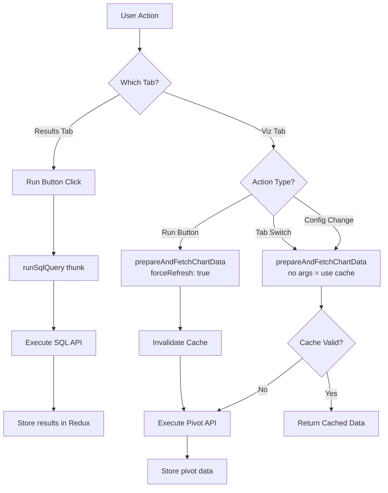

<summary>
SQL Runner feature for executing SQL queries and visualizing results. Supports two modes: Results tab (raw SQL output) and Visualization tab (pivoted chart data). Query execution is tab-aware to optimize performance.
</summary>

<howToUse>
The SQL Runner has two query types that run based on the active tab:

-   **Results tab**: Executes raw SQL via `runSqlQuery` thunk
-   **Visualization tab**: Executes pivot query via `prepareAndFetchChartData` thunk

Tab switching triggers pivot queries automatically (with caching). Clicking "Run" forces a fresh query.
</howToUse>

<codeExample>

```typescript
// Run normal SQL query (Results tab)
dispatch(
    runSqlQuery({
        sql: 'SELECT * FROM users',
        limit: 500,
        projectUuid,
        parameterValues,
    }),
);

// Run pivot query with cache (tab switching)
dispatch(prepareAndFetchChartData());

// Run pivot query forcing refresh (Run button click)
dispatch(prepareAndFetchChartData({ forceRefresh: true }));
```

</codeExample>

<importantToKnow>
**Query Flow by Action:**

| Action                | Query Executed | Uses Cache          |
| --------------------- | -------------- | ------------------- |
| Run on Results tab    | Normal SQL     | No                  |
| Run on Viz tab        | Pivot query    | No (force refresh)  |
| Switch to Viz tab     | Pivot query    | Yes                 |
| Switch to Results tab | None           | Uses cached results |

**Key Files:**

-   @/packages/frontend/src/features/sqlRunner/store/thunks.ts - Query thunks
-   @/packages/frontend/src/features/sqlRunner/store/sqlRunnerListeners.ts - Tab switch and config change listeners
-   @/packages/frontend/src/features/sqlRunner/components/ContentPanel.tsx - Main UI component
-   @/packages/frontend/src/features/queryRunner/BaseResultsRunner.ts - Pivot query caching

**Caching Behavior:**
The pivot query uses React Query's `fetchQuery` for caching. Cache is invalidated when:

-   User clicks "Run" on Viz tab (`forceRefresh: true`)
-   SQL columns change (new ResultsRunner created)

**Loading State:**
Both `runSqlQuery` and `prepareAndFetchChartData` set `queryIsLoading` state, which controls the Run button's loading indicator.
</importantToKnow>



<links>
- Query execution: @/packages/frontend/src/features/queryRunner/executeQuery.ts
- Pivot queries: @/packages/frontend/src/features/queryRunner/sqlRunnerPivotQueries.ts
- Redux slice: @/packages/frontend/src/features/sqlRunner/store/sqlRunnerSlice.ts
</links>
